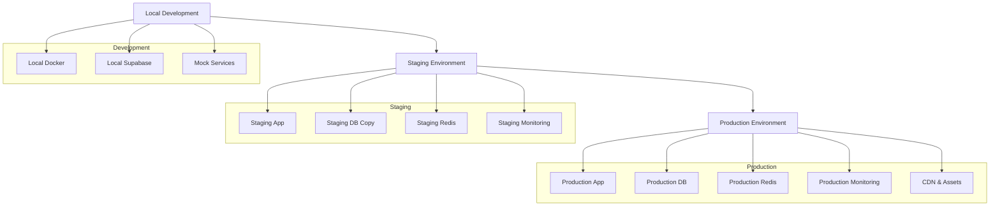
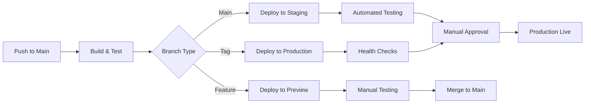
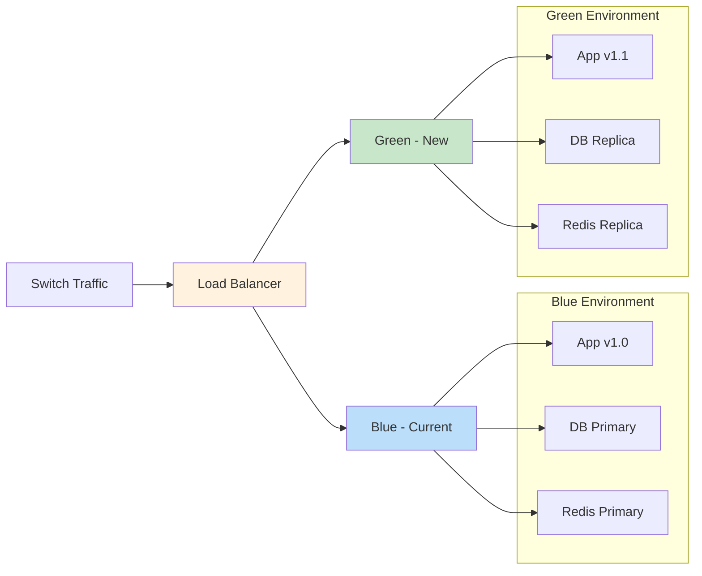

# Deployment Guide - Sistema de Gestión de Despacho Legal

**Version**: 1.0  
**Last Updated**: 2026-01-22  
**Target**: DevOps Engineers, System Administrators, Technical Leads

---

## 🎯 Overview

Esta guía cubre el despliegue completo del Sistema de Gestión de Despacho Legal desde desarrollo hasta producción, incluyendo estrategias de rollback, monitoreo y mantenimiento.

## 🌍 Environment Strategy

### Environment Hierarchy



### Environment Configuration

#### Local Development (.env.local)
```bash
# App Configuration
NEXT_PUBLIC_APP_ENV=development
NEXT_PUBLIC_APP_URL=http://localhost:3000

# Supabase Configuration
NEXT_PUBLIC_SUPABASE_URL=http://localhost:54321
NEXT_PUBLIC_SUPABASE_ANON_KEY=local-development-key
SUPABASE_SERVICE_ROLE_KEY=local-service-key

# Redis Configuration (local)
REDIS_URL=redis://localhost:6379

# Development Tools
NEXT_PUBLIC_DEBUG_MODE=true
ENABLE_MOCK_API=false
```

#### Staging Environment (.env.staging)
```bash
# App Configuration
NEXT_PUBLIC_APP_ENV=staging
NEXT_PUBLIC_APP_URL=https://staging.despacho-legal.com

# Supabase Configuration
NEXT_PUBLIC_SUPABASE_URL=https://staging.supabase.co
NEXT_PUBLIC_SUPABASE_ANON_KEY=eyJhbGciOiJIUzI1NiIsInR5cCI6IkpXVCJ9...
SUPABASE_SERVICE_ROLE_KEY=eyJhbGciOiJIUzI1NiIsInR5cCI6IkpXVCJ9...

# Redis Configuration
REDIS_URL=redis://staging-redis.cluster.com:6379

# Monitoring
SENTRY_DSN=https://sentry.io/staging-dsn
LOG_LEVEL=debug

# Feature Flags
ENABLE_RATE_LIMITING=true
ENABLE_CACHING=true
ENABLE_ANALYTICS=true
```

#### Production Environment (.env.production)
```bash
# App Configuration
NEXT_PUBLIC_APP_ENV=production
NEXT_PUBLIC_APP_URL=https://app.despacho-legal.com

# Supabase Configuration
NEXT_PUBLIC_SUPABASE_URL=https://production.supabase.co
NEXT_PUBLIC_SUPABASE_ANON_KEY=eyJhbGciOiJIUzI1NiIsInR5cCI6IkpXVCJ9...
SUPABASE_SERVICE_ROLE_KEY=eyJhbGciOiJIUzI1NiIsInR5cCI6IkpXVCJ9...

# Redis Configuration
REDIS_URL=redis://prod-redis.cluster.com:6379

# Monitoring & Security
SENTRY_DSN=https://sentry.io/production-dsn
LOG_LEVEL=error

# Rate Limiting
UPSTASH_REDIS_REST_URL=https://prod-upstash.redis.com
UPSTASH_REDIS_REST_TOKEN=upstash-production-token

# Feature Flags
ENABLE_RATE_LIMITING=true
ENABLE_CACHING=true
ENABLE_ANALYTICS=true
ENABLE_SECURITY_HEADERS=true
```

---

## 🚀 CI/CD Pipeline Strategy

### Pipeline Overview



### GitHub Actions Workflow

```yaml
# .github/workflows/deploy.yml
name: Deploy Application

on:
  push:
    branches: [main, develop]
  pull_request:
    branches: [main]
  workflow_dispatch:

env:
  REGISTRY: ghcr.io
  IMAGE_NAME: ${{ github.repository }}

jobs:
  test:
    runs-on: ubuntu-latest
    steps:
      - uses: actions/checkout@v4
      
      - name: Setup Node.js
        uses: actions/setup-node@v4
        with:
          node-version: '20'
          cache: 'npm'
          cache-dependency-path: 'despacho-web/package-lock.json'
      
      - name: Install dependencies
        working-directory: ./despacho-web
        run: npm ci
      
      - name: Run linting
        working-directory: ./despacho-web
        run: npm run lint
      
      - name: Run type checking
        working-directory: ./despacho-web
        run: npm run type-check
      
      - name: Run unit tests
        working-directory: ./despacho-web
        run: npm run test:unit -- --coverage
      
      - name: Upload coverage to Codecov
        uses: codecov/codecov-action@v3
        with:
          file: ./despacho-web/coverage/lcov.info
          flags: unittests
          name: codecov-umbrella

  e2e-tests:
    runs-on: ubuntu-latest
    needs: test
    steps:
      - uses: actions/checkout@v4
      
      - name: Setup Node.js
        uses: actions/setup-node@v4
        with:
          node-version: '20'
          cache: 'npm'
      
      - name: Install dependencies
        working-directory: ./despacho-web
        run: npm ci
      
      - name: Install Playwright
        working-directory: ./despacho-web
        run: npx playwright install --with-deps
      
      - name: Build application
        working-directory: ./despacho-web
        run: npm run build
      
      - name: Run E2E tests
        working-directory: ./despacho-web
        run: npm run test:e2e
      
      - name: Upload test results
        uses: actions/upload-artifact@v3
        if: failure()
        with:
          name: playwright-report
          path: ./despacho-web/playwright-report/

  build-image:
    runs-on: ubuntu-latest
    needs: [test, e2e-tests]
    outputs:
      image: ${{ steps.meta.outputs.tags }}
      digest: ${{ steps.build.outputs.digest }}
    steps:
      - uses: actions/checkout@v4
      
      - name: Set up Docker Buildx
        uses: docker/setup-buildx-action@v3
      
      - name: Log in to Container Registry
        uses: docker/login-action@v3
        with:
          registry: ${{ env.REGISTRY }}
          username: ${{ github.actor }}
          password: ${{ secrets.GITHUB_TOKEN }}
      
      - name: Extract metadata
        id: meta
        uses: docker/metadata-action@v5
        with:
          images: ${{ env.REGISTRY }}/${{ env.IMAGE_NAME }}
          tags: |
            type=ref,event=branch
            type=ref,event=pr
            type=semver,pattern={{version}}
            type=semver,pattern={{major}}.{{minor}}
            type=semver,pattern={{major}}
      
      - name: Build and push Docker image
        id: build
        uses: docker/build-push-action@v5
        with:
          context: ./despacho-web
          push: true
          tags: ${{ steps.meta.outputs.tags }}
          labels: ${{ steps.meta.outputs.labels }}
          cache-from: type=gha
          cache-to: type=gha,mode=max

  deploy-staging:
    runs-on: ubuntu-latest
    needs: build-image
    if: github.ref == 'refs/heads/develop'
    environment: staging
    steps:
      - uses: actions/checkout@v4
      
      - name: Deploy to Staging
        run: |
          echo "Deploying ${{ needs.build-image.outputs.image }} to staging"
          # Helm charts or Kubernetes deployment here
          
      - name: Run Health Checks
        run: |
          curl -f https://staging.despacho-legal.com/health || exit 1
          curl -f https://staging.despacho-legal.com/api/health || exit 1

  deploy-production:
    runs-on: ubuntu-latest
    needs: build-image
    if: startsWith(github.ref, 'refs/tags/')
    environment: production
    steps:
      - uses: actions/checkout@v4
      
      - name: Deploy to Production
        run: |
          echo "Deploying ${{ needs.build-image.outputs.image }} to production"
          # Blue-green deployment here
          
      - name: Run Production Health Checks
        run: |
          curl -f https://app.despacho-legal.com/health || exit 1
          curl -f https://app.despacho-legal.com/api/health || exit 1
```

---

## 🔧 Deployment Strategies

### 1. Blue-Green Deployment (Production)



**Implementation Steps:**
1. **Deploy Green Environment**: Deploy new version to green environment
2. **Health Checks**: Verify all services are healthy
3. **Database Sync**: Ensure database is in sync
4. **Traffic Switch**: Gradually shift traffic to green
5. **Monitor**: Monitor for issues for 30 minutes
6. **Clean Up**: Decommission blue environment if successful

**Rollback Strategy:**
- Immediate switch back to blue if issues detected
- Database transactions can be rolled back if needed
- Redis cache invalidation automatically handled

### 2. Rolling Update (Staging)

```yaml
# kubernetes/deployment.yml
apiVersion: apps/v1
kind: Deployment
metadata:
  name: despacho-legal-app
spec:
  replicas: 3
  strategy:
    type: RollingUpdate
    rollingUpdate:
      maxUnavailable: 1
      maxSurge: 1
  selector:
    matchLabels:
      app: despacho-legal-app
  template:
    metadata:
      labels:
        app: despacho-legal-app
    spec:
      containers:
      - name: app
        image: ghcr.io/despacho-legal/app:latest
        ports:
        - containerPort: 3000
        env:
        - name: NODE_ENV
          value: "production"
        livenessProbe:
          httpGet:
            path: /health
            port: 3000
          initialDelaySeconds: 30
          periodSeconds: 10
        readinessProbe:
          httpGet:
            path: /ready
            port: 3000
          initialDelaySeconds: 5
          periodSeconds: 5
```

---

## 🏥 Health Checks & Monitoring

### Health Check Endpoints

```typescript
// app/api/health/route.ts
import { NextResponse } from 'next/server'

export async function GET() {
  try {
    // Check database connection
    const supabase = await createClient()
    const { error } = await supabase.from('casos').select('count').single()
    
    // Check Redis connection
    const redis = new Redis(process.env.REDIS_URL!)
    await redis.ping()
    
    // Check external services
    const checks = {
      status: 'healthy',
      timestamp: new Date().toISOString(),
      version: process.env.npm_package_version,
      environment: process.env.NODE_ENV,
      services: {
        database: error ? 'unhealthy' : 'healthy',
        redis: 'healthy',
        sentry: process.env.SENTRY_DSN ? 'configured' : 'not configured'
      },
      metrics: {
        uptime: process.uptime(),
        memory: process.memoryUsage(),
        cpu: process.cpuUsage()
      }
    }
    
    return NextResponse.json(checks)
  } catch (error) {
    return NextResponse.json(
      {
        status: 'unhealthy',
        timestamp: new Date().toISOString(),
        error: error.message
      },
      { status: 503 }
    )
  }
}

// app/api/ready/route.ts
export async function GET() {
  // Readiness probe - check if app is ready to serve traffic
  const checks = {
    status: 'ready',
    timestamp: new Date().toISOString(),
    checks: {
      database: await checkDatabase(),
      redis: await checkRedis(),
      cache: await checkCacheWarmup()
    }
  }
  
  const allHealthy = Object.values(checks.checks).every(check => check.status === 'healthy')
  
  return NextResponse.json(checks, {
    status: allHealthy ? 200 : 503
  })
}

async function checkDatabase() {
  try {
    const supabase = await createClient()
    await supabase.from('profiles').select('id').limit(1)
    return { status: 'healthy' }
  } catch (error) {
    return { status: 'unhealthy', error: error.message }
  }
}

async function checkRedis() {
  try {
    const redis = new Redis(process.env.REDIS_URL!)
    await redis.ping()
    return { status: 'healthy' }
  } catch (error) {
    return { status: 'unhealthy', error: error.message }
  }
}

async function checkCacheWarmup() {
  try {
    // Check if critical cache is warmed
    const cache = new CacheService()
    const warm = await cache.checkCriticalCache()
    return { status: warm ? 'healthy' : 'warming' }
  } catch (error) {
    return { status: 'unhealthy', error: error.message }
  }
}
```

### Monitoring Stack

```typescript
// lib/monitoring/metrics.ts
import { register, Counter, Histogram, Gauge } from 'prom-client'

// Custom Metrics
export const httpRequestDuration = new Histogram({
  name: 'http_request_duration_seconds',
  help: 'Duration of HTTP requests in seconds',
  labelNames: ['method', 'route', 'status_code'],
  buckets: [0.1, 0.3, 0.5, 0.7, 1, 3, 5, 7, 10]
})

export const httpRequestTotal = new Counter({
  name: 'http_requests_total',
  help: 'Total number of HTTP requests',
  labelNames: ['method', 'route', 'status_code']
})

export const activeConnections = new Gauge({
  name: 'active_connections',
  help: 'Number of active connections'
})

export const databaseQueryDuration = new Histogram({
  name: 'database_query_duration_seconds',
  help: 'Duration of database queries in seconds',
  labelNames: ['table', 'operation'],
  buckets: [0.01, 0.05, 0.1, 0.25, 0.5, 1, 2.5, 5]
})

export const cacheHitRatio = new Gauge({
  name: 'cache_hit_ratio',
  help: 'Cache hit ratio',
  labelNames: ['cache_type']
})

// Register all metrics
register.registerMetric(httpRequestDuration)
register.registerMetric(httpRequestTotal)
register.registerMetric(activeConnections)
register.registerMetric(databaseQueryDuration)
register.registerMetric(cacheHitRatio)

// Metrics endpoint
export async function GET() {
  return new Response(await register.metrics(), {
    headers: { 'Content-Type': register.contentType }
  })
}
```

---

## 🔒 Security in Deployment

### Security Checklist

#### Pre-Deployment Security Checks
```bash
#!/bin/bash
# scripts/security-check.sh

echo "🔒 Running Security Checks..."

# 1. Dependency Scanning
echo "📦 Checking dependencies..."
npm audit --audit-level moderate
if [ $? -ne 0 ]; then
  echo "❌ Dependency audit failed"
  exit 1
fi

# 2. Environment Variables Validation
echo "🔍 Validating environment variables..."
node scripts/validate-env.js
if [ $? -ne 0 ]; then
  echo "❌ Environment validation failed"
  exit 1
fi

# 3. Code Security Scanning
echo "🛡️ Running code security scan..."
npm run security-scan
if [ $? -ne 0 ]; then
  echo "❌ Security scan failed"
  exit 1
fi

# 4. Container Security Scanning
echo "🐳 Scanning Docker image..."
docker run --rm -v /var/run/docker.sock:/var/run/docker.sock \
  -v $PWD:/root/.cache/ aquasec/trivy:latest image \
  ghcr.io/despacho-legal/app:$VERSION

# 5. SSL Certificate Check
echo "🔐 Checking SSL certificates..."
openssl x509 -in /path/to/cert.pem -noout -dates

echo "✅ All security checks passed"
```

#### Runtime Security Configuration
```typescript
// next.config.ts
const nextConfig = {
  // Security Headers
  async headers() {
    return [
      {
        source: '/(.*)',
        headers: [
          {
            key: 'X-Frame-Options',
            value: 'DENY'
          },
          {
            key: 'X-Content-Type-Options',
            value: 'nosniff'
          },
          {
            key: 'Referrer-Policy',
            value: 'strict-origin-when-cross-origin'
          },
          {
            key: 'X-XSS-Protection',
            value: '1; mode=block'
          }
        ]
      }
    ]
  },
  
  // Security Configuration
  experimental: {
    reactCompiler: true
  },
  
  // Build Security
  webpack: (config, { isServer }) => {
    if (!isServer) {
      config.resolve.fallback = {
        ...config.resolve.fallback,
        fs: false,
        net: false,
        tls: false
      }
    }
    return config
  }
}
```

---

## 🔄 Rollback Procedures

### Automated Rollback Script

```bash
#!/bin/bash
# scripts/rollback.sh

set -e

VERSION=$1
ENVIRONMENT=${2:-production}

if [ -z "$VERSION" ]; then
  echo "Usage: $0 <version> [environment]"
  echo "Example: $0 v1.2.3 staging"
  exit 1
fi

echo "🔄 Rolling back $ENVIRONMENT to version $VERSION"

# 1. Get previous version images
PREVIOUS_IMAGES=$(kubectl get deployment despacho-legal-app \
  -n $ENVIRONMENT \
  -o jsonpath='{.spec.template.spec.containers[0].image}')

echo "Current images: $PREVIOUS_IMAGES"

# 2. Update deployment to previous version
kubectl set image deployment/despacho-legal-app \
  despacho-legal-app=ghcr.io/despacho-legal/app:$VERSION \
  -n $ENVIRONMENT

# 3. Wait for rollout
kubectl rollout status deployment/despacho-legal-app \
  -n $ENVIRONMENT \
  --timeout=300s

# 4. Verify health
echo "🏥 Verifying health after rollback..."
sleep 30

HEALTH_URL="https://$ENVIRONMENT.despacho-legal.com/health"
if curl -f $HEALTH_URL; then
  echo "✅ Rollback successful - Health check passed"
else
  echo "❌ Rollback failed - Health check failed"
  exit 1
fi

# 5. Notify team
curl -X POST -H 'Content-type: application/json' \
  --data '{"text":"🔄 Rollback completed: $ENVIRONMENT -> $VERSION"}' \
  $SLACK_WEBHOOK_URL

echo "✅ Rollback to $VERSION completed successfully"
```

### Database Rollback Strategy

```sql
-- scripts/rollback-migration.sql

-- Migration Rollback Script
-- Each migration must have corresponding rollback

-- Create rollback function
CREATE OR REPLACE FUNCTION rollback_migration(migration_version TEXT)
RETURNS VOID AS $$
DECLARE
  rollback_sql TEXT;
BEGIN
  -- Get rollback SQL for the migration
  SELECT rollback_command INTO rollback_sql
  FROM migration_log
  WHERE version = migration_version
  AND rollback_status = 'ready';
  
  IF rollback_sql IS NULL THEN
    RAISE EXCEPTION 'Rollback not available for migration %', migration_version;
  END IF;
  
  -- Execute rollback
  EXECUTE rollback_sql;
  
  -- Update migration log
  UPDATE migration_log
  SET rollback_status = 'completed',
      rollback_date = NOW(),
      rolled_back_by = current_user
  WHERE version = migration_version;
  
  RAISE NOTICE 'Migration % rolled back successfully', migration_version;
END;
$$ LANGUAGE plpgsql;

-- Example rollback for adding new column
-- Migration: add_patrocinado_column_v1.2.0
-- Rollback:
ALTER TABLE casos DROP COLUMN IF EXISTS patrocinado;

-- Log the rollback
INSERT INTO migration_log (version, description, rollback_command, rollback_status)
VALUES (
  'v1.2.0',
  'Rollback: Added patrocinado column',
  'ALTER TABLE casos DROP COLUMN IF EXISTS patrocinado;',
  'completed'
);
```

---

## 📊 Deployment Metrics & SLAs

### Service Level Objectives (SLOs)

| Metric | Target | Measurement | Alert Threshold |
|--------|--------|-------------|-----------------|
| Availability | 99.9% | Uptime monitoring | < 99.5% |
| Response Time | < 200ms | API response time | > 500ms |
| Error Rate | < 1% | 5xx errors | > 5% |
| Deployment Time | < 10 min | Deployment duration | > 30 min |
| Rollback Time | < 5 min | Rollback duration | > 15 min |

### Deployment Dashboard Metrics

```typescript
// lib/monitoring/dashboard.ts
export interface DeploymentMetrics {
  deployment: {
    version: string
    timestamp: string
    duration: number
    status: 'success' | 'failed' | 'rolling-back'
  }
  
  performance: {
    response_time_p95: number
    error_rate: number
    throughput: number
    availability: number
  }
  
  infrastructure: {
    cpu_usage: number
    memory_usage: number
    disk_usage: number
    network_io: number
  }
}

export function getDeploymentMetrics(): Promise<DeploymentMetrics> {
  // Aggregate metrics from various monitoring sources
  return Promise.all([
    getDeploymentInfo(),
    getPerformanceMetrics(),
    getInfrastructureMetrics()
  ]).then(([deployment, performance, infrastructure]) => ({
    deployment,
    performance,
    infrastructure
  }))
}
```

---

## 🚨 Incident Response

### Incident Severity Levels

| Severity | Response Time | Impact | Examples |
|----------|---------------|--------|----------|
| Critical | 5 minutes | Complete outage | Site down, data loss |
| High | 15 minutes | Major feature broken | Login failures, payment issues |
| Medium | 1 hour | Minor feature broken | Slow loading, UI bugs |
| Low | 4 hours | Cosmetic issues | Typos, styling issues |

### Incident Runbook

```bash
#!/bin/bash
# scripts/incident-response.sh

SEVERITY=$1
INCIDENT_ID=$2

echo "🚨 Incident Response: $SEVERITY - $INCIDENT_ID"

case $SEVERITY in
  "critical")
    echo "🔴 CRITICAL INCIDENT - Immediate response required"
    
    # 1. Enable maintenance mode
    kubectl annotate ingress/ingress-despacho-legal \
      nginx.ingress.kubernetes.io/maintenance-annotation="true"
    
    # 2. Scale down to prevent further damage
    kubectl scale deployment despacho-legal-app --replicas=0
    
    # 3. Alert on-call team
    curl -X POST -H 'Content-type: application/json' \
      --data "{\"text\":\"🔴 CRITICAL INCIDENT $INCIDENT_ID - On-call team mobilized\"}" \
      $SLACK_EMERGENCY_WEBHOOK
    
    # 4. Create incident channel
    # (Slack automation here)
    ;;
    
  "high")
    echo "🟠 HIGH INCIDENT - Urgent response required"
    
    # 1. Partial maintenance mode
    # (Route non-critical traffic to error page)
    
    # 2. Alert team
    curl -X POST -H 'Content-type: application/json' \
      --data "{\"text\":\"🟠 HIGH INCIDENT $INCIDENT_ID - Team notified\"}" \
      $SLACK_ALERTS_WEBHOOK
    ;;
    
  "medium")
    echo "🟡 MEDIUM INCIDENT - Normal response"
    curl -X POST -H 'Content-type: application/json' \
      --data "{\"text\":\"🟡 MEDIUM INCIDENT $INCIDENT_ID - Assigned to next available\"}" \
      $SLACK_ALERTS_WEBHOOK
    ;;
esac

# Create incident log
echo "$(date): Incident $INCIDENT_ID - Severity: $SEVERITY" >> /var/log/incidents.log
```

---

## 🔧 Maintenance Procedures

### Scheduled Maintenance

```bash
#!/bin/bash
# scripts/maintenance.sh

MAINTENANCE_TYPE=$1
DURATION=$2

echo "🔧 Starting maintenance: $MAINTENANCE_TYPE"

# 1. Notify users (scheduled)
curl -X POST -H 'Content-type: application/json' \
  --data "{\"text\":\"🔧 Scheduled maintenance starting in 15 minutes\"}" \
  $SLACK_USER_WEBHOOK

# 2. Enable maintenance mode
kubectl annotate ingress/ingress-despacho-legal \
  nginx.ingress.kubernetes.io/maintenance-annotation="true"

# 3. Perform maintenance
case $MAINTENANCE_TYPE in
  "database-migration")
    echo "Running database migration..."
    npm run migrate:prod
    ;;
    
  "redis-maintenance")
    echo "Performing Redis maintenance..."
    # Redis operations here
    ;;
    
  "security-patches")
    echo "Applying security patches..."
    npm audit fix
    docker build -t ghcr.io/despacho-legal/app:patched .
    docker push ghcr.io/despacho-legal/app:patched
    ;;
esac

# 4. Verify systems
echo "🏥 Verifying systems..."
./scripts/health-check.sh

# 5. Disable maintenance mode
kubectl annotate ingress/ingress-despacho-legal \
  nginx.ingress.kubernetes.io/maintenance-annotation-

# 6. Notify completion
curl -X POST -H 'Content-type: application/json' \
  --data "{\"text\":\"✅ Maintenance completed successfully\"}" \
  $SLACK_USER_WEBHOOK

echo "✅ Maintenance completed"
```

---

## 📋 Pre-Deployment Checklist

### Environment Preparation
- [ ] Backup current database
- [ ] Backup Redis cache
- [ ] Verify monitoring systems operational
- [ ] Check alerting configuration
- [ ] Validate environment variables
- [ ] Security scan completed
- [ ] Dependencies audited

### Application Validation
- [ ] All tests passing in CI/CD
- [ ] Performance benchmarks met
- [ ] Security headers configured
- [ ] Rate limiting enabled
- [ ] Error handling verified
- [ ] Cache warming completed

### Infrastructure Readiness
- [ ] Load balancer configured
- [ ] Auto-scaling policies set
- [ ] CDN cache purged
- [ ] SSL certificates valid
- [ ] Database connections pooled
- [ ] Redis cluster healthy

### Rollback Preparation
- [ ] Previous images available
- [ ] Rollback scripts tested
- [ ] Database backups verified
- [ ] Communication channels ready
- [ ] Monitoring dashboards configured

---

## 📞 Support & Escalation

### Support Channels

| Level | Channel | Response Time | Escalation |
|-------|----------|---------------|-------------|
| L1 | Slack #support | 15 minutes | L2 after 30 min |
| L2 | Slack #engineering | 10 minutes | L3 after 20 min |
| L3 | On-call engineer | 5 minutes | Management after 10 min |

### Emergency Contacts

| Role | Contact | Method | Availability |
|------|---------|--------|-------------|
| On-call Engineer | +1-555-ONCALL | Phone/Slack | 24/7 |
| DevOps Lead | +1-555-DEVOPS | Phone/Slack | 24/7 |
| CTO | +1-555-CTO | Phone | Critical only |

---

**Document Maintainers**: DevOps Team  
**Last Updated**: 2026-01-22  
**Next Review**: 2026-02-22  
**Version**: 1.0