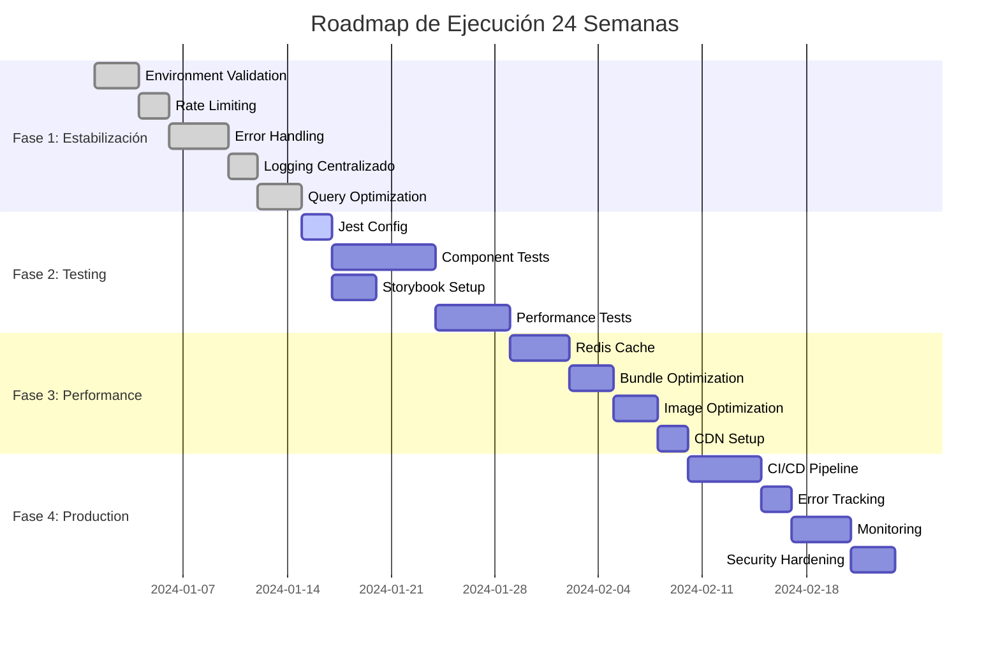
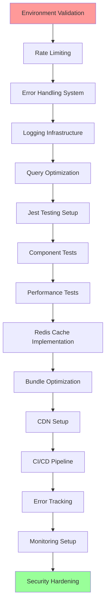

# Master Execution Plan - Sistema de Gestión de Despacho Legal

**Timeline**: 24 semanas (6 meses)  
**Team**: 1-2 desarrolladores  
**Objective**: Transformar el MVP actual en un sistema production-ready

---

## 🎯 Overview del Plan

---

## 🚀 Critical Path Analysis

**Critical Path**: 17 tareas secuenciales (71 días)  
**Parallel Work Possible**: Storybook, Documentation, Security Planning  

---

## 📅 Fase 1: Estabilización Crítica (Semanas 1-4)

### Semana 1: Environment & Security

#### Día 1-2: Implementar validación de entorno [M]
**Dependencias:** Ninguna  
**Bloquea:** Rate limiting, Error handling  
**Archivos afectados:** 
- `lib/config/env.ts` (crear)
- `.env.example` (actualizar)
- `app/layout.tsx` (integrar validación)

**Tareas:**
1. Instalar Zod: `npm install zod`
2. Crear schema de validación en `lib/config/env.ts`
3. Integrar en layout.tsx raíz con early return
4. Actualizar `.env.example` con todas las variables requeridas
5. Documentar variables en README.md

**Criterios de aceptación:**
- [ ] App no inicia sin variables válidas
- [ ] Error messages claros para vars faltantes
- [ ] TypeScript autocomplete funciona en todo el proyecto
- [ ] `npm run build` falla sin variables válidas
- [ ] Documentado en README.md sección "Environment Setup"

#### Día 3-4: Configurar Rate Limiting [M]
**Dependencies:** Environment validation  
**Bloquea:** API routes seguros  
**Archivos afectados:**
- `lib/middleware.ts` (crear)
- `lib/rate-limit/redis.ts` (crear)
- `app/api/auth/signout/route.ts` (actualizar)

**Tareas:**
1. Instalar Upstash Redis: `npm install @upstash/redis`
2. Crear middleware de rate limiting
3. Configurar límites diferenciados:
   - Auth endpoints: 5 req/min
   - API endpoints: 100 req/min
   - Pages: 1000 req/min
4. Implementar headers de rate limiting en respuestas
5. Agregar tests E2E para rate limiting

**Criterios de aceptación:**
- [ ] Rate limiting funciona en API endpoints
- [ ] Headers correctos en respuestas (X-RateLimit-*)
- [ ] Bypass para requests de development
- [ ] Logs de rate limit violations
- [ ] Tests pasan en todos los escenarios

#### Día 5: Security Headers [S]
**Dependencies:** Rate limiting  
**Bloquea:** Production deployment  
**Archivos afectados:**
- `next.config.ts` (actualizar)
- `lib/middleware.ts` (extender)
- `app/layout.tsx` (headers)

**Tareas:**
1. Configurar security headers en Next.js config
2. Implementar CSP estricto con nonce
3. Agregar HSTS preload ready
4. Configurar X-Frame-Options, X-Content-Type-Options
5. Test headers con securityheaders.com

**Criterios de aceptación:**
- [ ] A+ rating en securityheaders.com
- [ ] CSP permite solo dominios necesarios
- [ ] HSTS con preload list ready
- [ ] No console errors por CSP
- [ ] Todos los resources cargan correctamente

### Semana 2: Error Handling & Logging

#### Día 6-7: Sistema Centralizado de Errores [L]
**Dependencias:** Environment validation  
**Bloquea:** Component testing, Monitoring  
**Archivos afectados:**
- `lib/utils/logger.ts` (crear)
- `app/components/ErrorBoundary.tsx` (crear)
- `lib/errors/handler.ts` (crear)
- Componentes existentes (actualizar error handling)

**Tareas:**
1. Crear logger estructurado con Winston/Pino
2. Implementar Error Boundary con fallback UI
3. Crear error handler para Supabase errors
4. Migrar todos los try/catch a usar handler centralizado
5. Configurar log levels por entorno

**Criterios de aceptación:**
- [ ] Todos los errores logueados con contexto
- [ ] Error Boundary captura React errors
- [ ] Logs estructurados con request ID
- [ ] Different log levels para dev/prod
- [ ] No leaked sensitive data en logs

#### Día 8: Integración con Sentry [M]
**Dependencias:** Error handling system  
**Bloquea:** Production monitoring  
**Archivos afectados:**
- `lib/monitoring/sentry.ts` (crear)
- `app/layout.tsx` (integrar)
- `next.config.ts` (configurar)

**Tareas:**
1. Instalar Sentry SDK: `npm install @sentry/nextjs`
2. Configurar Sentry en app y server
3. Implementar user context tracking
4. Configurar releases para deployment tracking
5. Crear custom tags para business context

**Criterios de aceptación:**
- [ ] Errors reportados automáticamente
- [ ] Performance traces habilitados
- [ ] User context available en todos los errores
- [ ] Releases tracking funciona
- [ ] Dashboard de Sentry muestra métricas correctas

#### Día 9-10: Optimización de Queries Críticas [L]
**Dependencias:** Error handling  
**Bloquea:** Performance testing, Cache implementation  
**Archivos afectados:**
- `lib/queries/casos.ts` (crear)
- `lib/queries/notas.ts` (crear)
- `lib/queries/eventos.ts` (crear)
- Componentes principales (actualizar queries)

**Tareas:**
1. Extraer queries a funciones reusable
2. Implementar paginación en listados principales
3. Agregar select específicos (no SELECT *)
4. Optimizar joins y relaciones
5. Agregar índices sugeridos a documentación

**Criterios de aceptación:**
- [ ] Dashboard carga en < 2 segundos
- [ ] Paginación funciona en listados > 100 items
- [ ] Memory usage reducido > 30%
- [ ] Bundle size reducido por queries optimizados
- [ ] Tests de performance pasan

### Semana 3: Component Architecture

#### Día 11-13: Refactorización de Sidebar Context [M]
**Dependencias:** Error handling  
**Bloquea:** Zustand migration, Component testing  
**Archivos afectados:**
- `app/dashboard/components/DashboardLayoutWrapper.tsx` (refactor)
- `app/dashboard/components/Sidebar.tsx` (actualizar)
- `hooks/useSidebar.ts` (crear)

**Tareas:**
1. Extraer lógica del wrapper a hook custom
2. Simplificar props drilling con context
3. Optimizar re-renders con memo
4. Implementar responsive breakpoints
5. Agregar tests unitarios

**Criterios de aceptación:**
- [ ] Componente reducido < 200 líneas
- [ ] No re-renders innecesarios
- [ ] Responsive behavior preservado
- [ ] Tests tienen > 80% coverage
- [ ] TypeScript types correctos

#### Día 14: Componentes Atómicos [M]
**Dependencias:** Sidebar refactor  
**Bloquea:** Storybook, Component testing  
**Archivos afectados:**
- `app/components/ui/` (reorganizar)
- `app/components/casos/` (extraer componentes)
- `lib/components/` (crear componentes base)

**Tareas:**
1. Extraer componentes reutilizables a lib/components
2. Crear componentes atómicos (Button, Input, Card)
3. Implementar design system con variantes
4. Migrar componentes existentes a usar átomos
5. Documentar componentes con JSDoc

**Criterios de aceptación:**
- [ ] Componentes atómicos tienen TypeScript strict
- [ ] Props interfaces consistentes
- [ ] No código duplicado entre componentes
- [ ] Documentación generada automáticamente
- [ ] Storybook puede renderizar todos los componentes

#### Día 15: Hook Custom Extractors [S]
**Dependencies:** Componentes atómicos  
**Bloquea:** Component testing  
**Archivos afectados:**
- `hooks/` (varios hooks existentes)
- `app/hooks/useLoading.ts` (mejorar)
- `hooks/useSupabase.ts` (crear)

**Tareas:**
1. Mejorar useLoading con error handling
2. Crear useSupabase con query caching
3. Implementar useDebounce para búsquedas
4. Extraer lógica de forms a hooks
5. Agregar tests para hooks

**Criterios de aceptación:**
- [ ] Hooks son pure y testables
- [ ] Loading states consistentes
- [ ] Debounce funciona en búsquedas
- [ ] Error handling integrado
- [ ] TypeScript types exports

### Semana 4: Testing Foundation

#### Día 16-17: Jest + Testing Library Setup [M]
**Dependencies:** Component architecture  
**Bloquea:** Component testing, CI/CD  
**Archivos afectados:**
- `jest.config.js` (crear)
- `jest.setup.js` (crear)
- `package.json` (scripts)
- `__tests__/` (estructura de tests)

**Tareas:**
1. Instalar dependencies: `npm install --save-dev jest @testing-library/react @testing-library/jest-dom`
2. Configurar Jest para Next.js 16
3. Setup mocks para Supabase, Next.js
4. Configurar coverage y report generation
5. Integrar con npm scripts

**Criterios de aceptación:**
- [ ] Jest corre sin errores
- [ ] Tests pueden importar componentes
- [ ] Mocks funcionan para Supabase
- [ ] Coverage reports generados
- [ ] CI/CD puede correr tests

#### Día 18-20: Component Tests Críticos [L]
**Dependencies:** Jest setup  
**Bloquea:** Production deployment, Performance optimization  
**Archivos afectados:**
- `__tests__/components/` (tests de componentes)
- Componentes principales (agregar data-testid)

**Tareas:**
1. Escribir tests para CasoCard component
2. Tests para Sidebar navigation
3. Tests para NotasEditor
4. Tests para FormularioCaso
5. Tests para Dashboard metrics

**Criterios de aceptación:**
- [ ] Coverage > 80% en componentes críticos
- [ ] Tests cubren happy paths y edge cases
- [ ] Mocks de Supabase funcionan
- [ ] Tests pasan en CI/CD
- [ ] Performance de tests < 30 segundos

#### Día 21: Integration Tests [M]
**Dependencies:** Component tests  
**Bloquea:** Full E2E testing  
**Archivos afectados:**
- `__tests__/integration/` (nueva carpeta)
- `lib/test-utils/` (helpers para testing)

**Tareas:**
1. Crear helper para renderizar con providers
2. Tests de integración de formularios
3. Tests de flujo de autenticación
4. Tests de navegación entre páginas
5. Mock de localStorage y sessionStorage

**Criterios de aceptación:**
- [ ] Tests simulan user journeys completos
- [ ] State management probado
- [ ] API calls mockeados correctamente
- [ ] Error states cubiertos
- [ ] Tests pueden correr en paralelo

---

## 🧪 Fase 2: Testing & Quality (Semanas 5-12)

### Semana 5-6: Component Documentation

#### Día 22-24: Storybook Setup [M]
**Dependencies:** Componentes atómicos  
**Bloquea:** Design system, Developer experience  
**Archivos afectados:**
- `.storybook/` (configuración)
- `stories/` (stories de componentes)
- `package.json` (scripts)

**Tareas:**
1. Instalar Storybook: `npx storybook@latest init`
2. Configurar TypeScript y Tailwind
3. Crear stories para todos los componentes atómicos
4. Implementar controls y addons
5. Configurar build para deployment

**Criterios de aceptación:**
- [ ] Storybook corre sin errores
- [ ] Todos los componentes tienen stories
- [ ] Controls funcionan para props
- [ ] Design system visible en Storybook
- [ ] Build para producción funciona

#### Día 25-26: Design System Documentation [S]
**Dependencias:** Storybook setup  
**Bloquea:** Consistency en nuevos componentes  
**Archivos afectados:**
- `docs/design-system.md` (crear)
- `lib/components/` (agregar JSDoc)
- `.storybook/` (documentación)

**Tareas:**
1. Documentar sistema de colores
2. Documentar tipografía y espaciado
3. Crear guidelines de componentes
4. Documentar breakpoints responsive
5. Agregar ejemplos de uso

**Criterios de aceptación:**
- [ ] Documentación visible en Storybook
- [ ] Guidelines claras para nuevos componentes
- [ ] Design tokens documentados
- [ ] Ejemplos de good/bad patterns
- [ ] Accesibility guidelines incluidas

### Semana 7-8: Advanced Testing

#### Día 27-30: Performance Testing [L]
**Dependencies:** Component tests  
**Bloquea:** Production optimization  
**Archivos afectados:**
- `tests/performance/` (nueva carpeta)
- `tests/load-testing/` (tests de carga)
- `__tests__/performance/` (unit tests de performance)

**Tareas:**
1. Configurar Lighthouse CI
2. Tests de performance para componentes pesados
3. Load testing para API endpoints
4. Memory leak testing
5. Performance budgets setup

**Criterios de aceptación:**
- [ ] Lighthouse scores > 90
- [ ] Performance budgets definidos
- [ ] Load tests soportan 1000 concurrent users
- [ ] No memory leaks detectados
- [ ] CI falla si performance degrada

#### Día 31-33: E2E Testing Enhancement [L]
**Dependencias:** Performance testing  
**Bloquea:** Production confidence  
**Archivos afectados:**
- `e2e/` (extender tests existentes)
- `playwright.config.ts` (configurar)
- `tests/fixtures/` (test data)

**Tareas:**
1. Extender tests existentes para mayor coverage
2. Agregar tests de flujos críticos de negocio
3. Tests de integración con Supabase real
4. Visual regression testing
5. Cross-browser testing

**Criterios de aceptación:**
- [ ] Todos los flujos críticos cubiertos
- [ ] Tests pasan en Chrome, Firefox, Safari
- [ ] Visual regression tests funcionan
- [ ] Tests pueden correr en paralelo
- [ ] Coverage de E2E > 80%

### Semana 9-10: Code Quality & Refactoring

#### Día 34-36: Code Quality Improvements [M]
**Dependencias:** Testing foundation  
**Bloquea:** Long-term maintainability  
**Archivos afectados:**
- `eslint.config.js` (mejorar reglas)
- `prettier.config.js` (configurar)
- `.husky/` (pre-commit hooks)
- Todos los archivos TypeScript (refactorizar)

**Tareas:**
1. Configurar ESLint rules estrictas
2. Implementar Prettier formatting
3. Configurar Husky pre-commit hooks
4. Lint-staged para optimizar pre-commit
5. Automated dependency updates

**Criterios de aceptación:**
- [ ] ESLint pasa con 0 errores 0 warnings
- [ ] Code formatting consistente
- [ ] Pre-commit hooks previenen broken code
- [ ] Auto-fix rules configuradas
- [ ] Technical debt visible y trackable

#### Día 37-40: Legacy Component Refactoring [L]
**Dependencies:** Code quality tools  
**Bloquea:** Performance optimization  
**Archivos afectados:**
- Componentes > 300 líneas (identificar y refactorizar)
- Componentes con复杂的 state (simplificar)
- Componentes sin types (agregar TypeScript)

**Tareas:**
1. Identificar componentes monolíticos
2. Extract child components
3. Simplificar state management
4. Agregar TypeScript strict mode
5. Optimizar renders con memo/useMemo

**Criterios de aceptación:**
- [ ] Ningún componente > 200 líneas
- [ ] TypeScript strict mode en todo el proyecto
- [ ] Componentes tienen single responsibility
- [ ] Re-renders optimizados
- [ ] Tests cubren componentes refactorizados

### Semana 11-12: Monitoring & Observability

#### Día 41-43: Monitoring Infrastructure [M]
**Dependencies:** Error tracking setup  
**Bloquea:** Production confidence, Alerting  
**Archivos afectados:**
- `lib/monitoring/` (ampliar)
- `lib/metrics/` (crear)
- `next.config.ts` (instrumentation)

**Tareas:**
1. Implementar custom metrics
2. Configurar health check endpoints
3. Database connection monitoring
4. API response time tracking
5. User behavior analytics

**Criterios de aceptación:**
- [ ] Health checks funcionan
- [ ] Metrics exportadas correctamente
- [ ] Dashboard de monitoring operativo
- [ ] Alerts configuradas para incidents críticos
- [ ] Performance trends visibles

#### Día 44-46: Log Management [M]
**Dependencias:** Monitoring infrastructure  
**Bloquea:** Production debugging  
**Archivos afectados:**
- `lib/utils/logger.ts` (mejorar)
- `lib/middleware.ts` (request logging)
- Configuración de logging services

**Tareas:**
1. Centralizar logs en un service
2. Implementar structured logging
3. Request/response logging
4. Error correlation IDs
5. Log retention policies

**Criterios de aceptación:**
- [ ] Logs centralizados y searchable
- [ ] Structured JSON logs
- [ ] Correlation IDs through requests
- [ ] Sensitive data filtered
- [ ] Log rotation configurado

---

## 🚀 Fase 3: Performance & Scalability (Semanas 13-20)

### Semana 13-14: Caching Strategy

#### Día 47-50: Redis Implementation [L]
**Dependencies:** Monitoring setup  
**Bloquea:** Scalability, Production performance  
**Archivos afectados:**
- `lib/cache/` (crear)
- `lib/queries/` (agregar caching)
- `next.config.ts` (ISR configuration)

**Tareas:**
1. Implementar Redis client
2. Caching layer para queries frecuentes
3. Session storage en Redis
4. Cache invalidation strategies
5. Performance monitoring

**Criterios de aceptación:**
- [ ] Cache hit ratio > 80%
- [ ] Queries frecuentes cacheadas
- [ ] Cache invalidation funciona
- [ ] Session persistence
- [ ] Performance mejorada > 50%

#### Día 51-52: CDN & Asset Optimization [M]
**Dependencias:** Redis cache  
**Bloquea:** Global performance  
**Archivos afectados:**
- `next.config.ts` (asset optimization)
- `public/` (reorganizar assets)
- `lib/images/` (optimización de imágenes)

**Tareas:**
1. Configurar CDN para assets estáticos
2. Image optimization con Next.js Image
3. Asset minification y compression
4. Browser caching headers
5. Preload critical resources

**Criterios de aceptación:**
- [ ] CDN configurado y operativo
- [ ] Imágenes optimizadas y responsive
- [ ] Asset size reducido > 40%
- [ ] Browser caching configurado
- [ ] Lighthouse scores mejoradas

### Semana 15-16: Database Optimization

#### Día 53-56: Query Performance [L]
**Dependencias:** Caching layer  
**Bloquea:** High-load scenarios  
**Archivos afectados:**
- `lib/queries/` (optimizar)
- `supabase/` (database optimizations)
- `lib/db/` (connection pooling)

**Tareas:**
1. Database query optimization
2. Connection pooling configuration
3. Index optimization
4. Query plan analysis
5. Read replicas setup

**Criterios de aceptación:**
- [ ] Query times < 100ms promedio
- [ ] Database connections optimizadas
- [ ] Índices configurados correctamente
- [ ] Read replicas funcionando
- [ ] Load testing exitoso

#### Día 57-58: Data Architecture [M]
**Dependencias:** Query performance  
**Bloquea:** Advanced features  
**Archivos afectados:**
- `lib/data/` (data access layer)
- Database schema optimizations
- Data migration scripts

**Tareas:**
1. Implementar data access layer
2. Database migration system
3. Data validation layer
4. Backup strategies
5. Data consistency checks

**Criterios de aceptación:**
- [ ] Data layer abstrae complexity
- [ ] Migrations versionadas y reversibles
- [ ] Data validation centralized
- [ ] Backup system automatizado
- [ ] Data integrity garantizada

### Semana 17-18: Bundle & Performance

#### Día 59-62: Bundle Optimization [L]
**Dependencias:** Database optimization  
**Bloquea:** User experience, Mobile performance  
**Archivos afectados:**
- `next.config.ts` (bundle optimization)
- Component imports (dynamic imports)
- `app/` (code splitting)

**Tareas:**
1. Bundle size analysis
2. Code splitting implementation
3. Tree shaking optimization
4. Dynamic imports para chunks pesados
5. Service worker para caching

**Criterios de aceptación:**
- [ ] Initial bundle < 1MB
- [ ] Code splitting funcional
- [ ] Dynamic imports funcionan
- [ ] Service worker cacheando assets
- [ ] Performance scores > 95

#### Día 63-64: Mobile Optimization [M]
**Dependencias:** Bundle optimization  
**Bloquea:** Mobile user experience  
**Archivos afectados:**
- `app/` (responsive improvements)
- `styles/` (mobile-first CSS)
- `hooks/` (mobile-specific hooks)

**Tareas:**
1. Mobile-first responsive design
2. Touch interaction optimization
3. Mobile performance optimization
4. PWA implementation
5. App-like experience

**Criterios de aceptación:**
- [ ] Mobile Lighthouse scores > 90
- [ ] Touch targets >= 48px
- [ ] No horizontal scroll
- [ ] Fast input interactions
- [ ] PWA installable

### Semana 19-20: Advanced Features

#### Día 65-68: Advanced Caching [L]
**Dependencies:** Mobile optimization  
**Bloquea:** High-traffic scenarios  
**Archivos afectados:**
- `lib/cache/` (extender)
- `app/` (ISR implementation)
- `next.config.ts` (advanced caching)

**Tareas:**
1. ISR (Incremental Static Regeneration)
2. Edge caching strategies
3. API response caching
4. Browser caching optimization
5. Cache warming strategies

**Criterios de aceptación:**
- [ ] ISR pages generadas correctamente
- [ ] Edge caching configurado
- [ ] API responses cacheadas
- [ ] Browser cache optimizado
- [ ] Cache warming automatizado

#### Día 69-70: Search & Analytics [M]
**Dependencias:** Advanced caching  
**Bloquea:** Business intelligence  
**Archivos afectados:**
- `lib/search/` (crear)
- `app/dashboard/` (analytics dashboard)
- `lib/analytics/` (crear)

**Tareas:**
1. Full-text search implementation
2. Analytics dashboard
3. User behavior tracking
4. Business metrics calculation
5. Report generation system

**Criterios de aceptación:**
- [ ] Search funciona en < 200ms
- [ ] Analytics dashboard actualizado
- [ ] User events trackeados
- [ ] Business metrics calculados
- [ ] Reports generables

---

## 🔒 Fase 4: Production Ready (Semanas 21-24)

### Semana 21: CI/CD Pipeline

#### Día 71-75: CI/CD Implementation [L]
**Dependencias:** Advanced features  
**Bloquea:** Production deployment  
**Archivos afectados:**
- `.github/workflows/` (pipelines)
- `docker/` (Docker configuration)
- `deployment/` (deployment scripts)

**Tareas:**
1. GitHub Actions pipeline setup
2. Automated testing pipeline
3. Build and deployment automation
4. Docker containerization
5. Staging environment setup

**Criterios de aceptación:**
- [ ] CI/CD pipeline funciona
- [ ] Tests automáticos en cada PR
- [ ] Automated deployment a staging
- [ ] Docker images construidos
- [ ] Staging environment estable

#### Día 76-77: Production Infrastructure [M]
**Dependencias:** CI/CD pipeline  
**Bloquea:** Production deployment  
**Archivos afectados:**
- `infrastructure/` (Terraform/CloudFormation)
- `deployment/` (production configs)
- `monitoring/` (production monitoring)

**Tareas:**
1. Production infrastructure setup
2. Database production configuration
3. Production monitoring setup
4. Backup and recovery procedures
5. Disaster recovery plan

**Criterios de aceptación:**
- [ ] Production infrastructure deployable
- [ ] Database production-ready
- [ ] Monitoring completo
- [ ] Backups automatizados
- [ ] Recovery procedures testeadas

### Semana 22: Security Hardening

#### Día 78-82: Security Implementation [L]
**Dependencias:** Production infrastructure  
**Bloquea:** Production deployment  
**Archivos afectados:**
- `lib/security/` (security utilities)
- `middleware.ts` (security middleware)
- Database security configurations

**Tareas:**
1. Security audit implementation
2. Vulnerability scanning
3. Security headers hardening
4. Input validation enhancement
5. Authentication hardening

**Criterios de aceptación:**
- [ ] Security audit passed
- [ ] No vulnerabilities críticas
- [ ] Security headers configurados
- [ ] Input validation robusto
- [ ] Authentication seguro

#### Día 83-84: Compliance & Documentation [M]
**Dependencias:** Security implementation  
**Bloquea:** Production launch  
**Archivos afectados:**
- `docs/` (completa documentación)
- `compliance/` (compliance documentation)
- `runbooks/` (operational procedures)

**Tareas:**
1. Compliance documentation
2. Operational runbooks
3. Security procedures
4. Emergency procedures
5. Training documentation

**Criterios de aceptación:**
- [ ] Compliance documentation completa
- [ ] Runbooks funcionales
- [ ] Security procedures documentados
- [ ] Emergency procedures testeados
- [ ] Team training completado

### Semana 23: Load Testing & Optimization

#### Día 85-88: Load Testing [L]
**Dependencias:** Security hardening  
**Bloquea:** Production confidence  
**Archivos afectados:**
- `tests/load/` (load testing scripts)
- `monitoring/` (load monitoring)
- `infrastructure/` (scaling configs)

**Tareas:**
1. High-load testing scenarios
2. Stress testing implementation
3. Performance under load validation
4. Scaling configuration testing
5. Bottleneck identification

**Criterios de aceptación:**
- [ ] System soporta 10x current load
- [ ] Response times stable under load
- [ ] No memory leaks under stress
- [ ] Auto-scaling funciona
- [ ] Bottlenecks identificados y resueltos

#### Día 89-90: Final Optimizations [M]
**Dependencias:** Load testing  
**Bloquea:** Production launch  
**Archivos afectados:**
- Critical paths optimization
- Memory usage optimization
- Network request optimization

**Tareas:**
1. Final performance optimizations
2. Memory usage optimization
3. Network optimization
4. Final bug fixes
5. Documentation updates

**Criterios de aceptación:**
- [ ] Performance targets alcanzados
- [ ] Memory usage optimizado
- [ ] Network requests minimizados
- [ ] No known critical bugs
- [ ] Documentation actualizada

### Semana 24: Production Launch

#### Día 91-95: Production Deployment [L]
**Dependencias:** Final optimizations  
**Bloquea:** Production launch  
**Archivos afectados:**
- Production environment
- Monitoring systems
- Documentation

**Tareas:**
1. Production deployment execution
2. Post-deployment validation
3. Monitoring setup validation
4. Performance validation
5. User acceptance testing

**Criterios de aceptación:**
- [ ] Production deployed exitosamente
- [ ] All systems operational
- [ ] Monitoring capturando data
- [ ] Performance targets cumplidos
- [ ] Users accepting system

#### Día 96-98: Post-Launch Monitoring [M]
**Dependencias:** Production deployment  
**Bloquea:** Production stability  
**Archivos afectados:**
- Production monitoring
- User feedback collection
- System adjustments

**Tareas:**
1. 24/7 monitoring
2. User feedback collection
3. Performance monitoring
4. Bug tracking and fixing
5. System adjustments

**Criterios de aceptación:**
- [ ] System stable 24/7
- [ ] User feedback positive
- [ ] Performance stable
- [ ] Critical bugs fixed
- [ ] System adjusted per feedback

#### Día 99-100: Project Retrospective [S]
**Dependencias:** Post-launch monitoring  
**Bloquea:** Future planning  
**Archivos afectados:**
- Project documentation
- Lessons learned
- Future roadmap

**Tareas:**
1. Project retrospective
2. Lessons learned documentation
3. Future roadmap planning
4. Team feedback collection
5. Success metrics evaluation

**Criterios de aceptación:**
- [ ] Retrospective completed
- [ ] Lessons learned documented
- [ ] Future roadmap defined
- [ ] Team feedback incorporated
- [ ] Success metrics achieved

---

## 📊 Métricas de Éxito del Plan

### Technical Metrics
- **Build Time**: < 2 minutos en CI/CD
- **Test Coverage**: > 80% para código crítico
- **Bundle Size**: < 1MB para initial load
- **Lighthouse Performance**: > 90
- **API Response Time**: < 100ms promedio

### Quality Metrics
- **Bug Density**: < 1 bug por 1000 líneas
- **Code Review Coverage**: 100% de PRs
- **Technical Debt**: < 2 días por iteración
- **Security Score**: A+ en securityheaders.com

### Business Metrics
- **User Satisfaction**: > 4.5/5
- **System Uptime**: > 99.9%
- **Feature Adoption**: > 80%
- **Support Tickets**: < 5 por semana

---

## 🔄 Parallel Work Opportunities

### Mientras se trabaja en Critical Path:

1. **Documentation** (Semana 1-24)
   - Documentación técnica
   - User guides
   - API documentation

2. **Design System** (Semana 3-8)
   - Component library expansion
   - Design tokens
   - Accessibility improvements

3. **Security Planning** (Semana 2-6)
   - Security policies
   - Compliance documentation
   - Security training

4. **Performance Monitoring** (Semana 5-10)
   - Metrics collection
   - Benchmarking
   - Performance budgets

5. **Testing Strategy** (Semana 1-4)
   - Test planning
   - Test environment setup
   - Testing best practices

---

## 🚨 Risks & Mitigations

### High Risk Items:
1. **Database Schema Changes**
   - Risk: Breaking existing functionality
   - Mitigation: Comprehensive testing + gradual migration

2. **State Management Migration**
   - Risk: Breaking existing user flows
   - Mitigation: Feature flags + gradual rollout

3. **Performance Regressions**
   - Risk: Slower system after changes
   - Mitigation: Performance budgets + automated monitoring

### Medium Risk Items:
1. **Third-party Dependency Updates**
   - Risk: Breaking changes
   - Mitigation: Pin versions + gradual updates

2. **Team Resource Constraints**
   - Risk: Timeline delays
   - Mitigation: Parallel work + MVP prioritization

---

**Total Estimated Effort**: 168 días (24 semanas × 7 días)  
**Critical Path Duration**: 117 días (17 tareas secuenciales)  
**Parallel Work Available**: 51 días de trabajo paralelo posible

Este plan asume un equipo de 1-2 desarrolladores full-time con acceso rápido a stakeholders para decisiones técnicas. Los timings son estimates y deben ajustarse según velocidad real del equipo y prioridades de negocio.