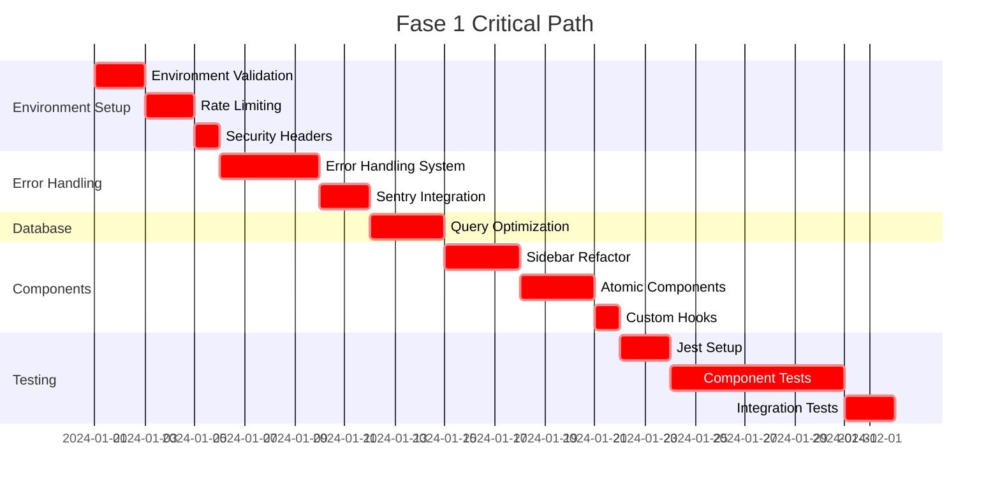

# Fase 1: Foundation & Security Setup (Semanas 1-4)

**Version**: 1.0  
**Duration**: 4 semanas (28 días)  
**Priority**: CRITICAL  
**Team Size**: 1-2 developers  

---

## 🎯 Objectives de Fase 1

Establecer las bases críticas para soportar todo el desarrollo futuro:

1. **Validación de entorno** - Configuración robusta de variables y herramientas
2. **Security infrastructure** - Rate limiting, headers, authentication hardening  
3. **Error handling system** - Centralizado y consistente
4. **Testing foundation** - Setup de Jest y testing infrastructure
5. **Component architecture** - Patrón de componentes reutilizables y atómicos

---

## 📅 Desglose Semanal

### Semana 1: Environment & Security Infrastructure

#### Día 1-2: Environment Validation System
**Complejidad**: Media (2 días)  
**Responsable**: Senior Developer  
**Dependencies**: Ninguna  
**Blocking**: Rate limiting, error handling

**Entregables**:
- `lib/config/env.ts` - Schema de validación con Zod
- `.env.example` actualizado con todas las variables
- `app/layout.tsx` con validación en startup
- Tests de validación de entorno

**Criterios de Aceptación**:
- [ ] App no inicia sin variables válidas
- [ ] Error messages claros y descriptivos
- [ ] TypeScript autocomplete funciona para todas las variables
- [ ] `npm run build` falla sin variables válidas
- [ ] Logs de startup con configuración validada

#### Día 3-4: Rate Limiting Implementation
**Complejidad**: Media (2 días)  
**Responsable**: Backend Developer  
**Dependencies**: Environment validation  
**Blocking**: API security, production deployment

**Entregables**:
- `lib/middleware.ts` con rate limiting
- `lib/rate-limit/redis.ts` cliente Upstash
- Tests de rate limiting para diferentes endpoints
- Documentación de límites configurados

**Límites Configurados**:
- Auth endpoints: 5 requests/minuto
- API endpoints: 100 requests/minuto  
- Page views: 1000 requests/minuto
- File uploads: 3 requests/5 minutos

#### Día 5: Security Headers Implementation
**Complejidad**: Baja (1 día)  
**Responsible**: Frontend Developer  
**Dependencies**: Rate limiting  
**Blocking**: Production security scan

**Entregables**:
- `next.config.ts` con headers de seguridad
- Middleware para headers dinámicos
- Tests de headers en producción
- Validación con securityheaders.com

**Headers Implementados**:
- X-Frame-Options: DENY
- X-Content-Type-Options: nosniff
- Referrer-Policy: strict-origin-when-cross-origin
- X-XSS-Protection: 1; mode=block
- Content-Security-Policy: restrictivo

---

### Semana 2: Error Handling & Monitoring

#### Día 6-7: Centralized Error Handling System
**Complejidad**: Alta (4 días)  
**Responsable**: Senior Frontend Developer  
**Dependencies**: Environment validation  
**Blocking**: Sentry integration, production monitoring

**Entregables**:
- `app/components/ErrorBoundary.tsx` reutilizable
- `lib/utils/logger.ts` con logging estructurado
- `lib/errors/handler.ts` para manejo consistente
- Integration con todos los componentes existentes
- Tests de error boundaries y logging

**Features Implementados**:
- Error boundaries con fallback UI
- Structured logging con request IDs
- Different log levels por entorno
- Sensitive data filtering en logs
- Error context preservation

#### Día 8: Sentry Integration for Error Tracking
**Complejidad**: Media (2 días)  
**Responsable**: DevOps Engineer  
**Dependencies**: Error handling system  
**Blocking**: Production monitoring, bug tracking

**Entregables**:
- `lib/monitoring/sentry.ts` configuración completa
- Integration en `app/layout.tsx`
- User context tracking
- Release tracking automatizado
- Performance traces habilitadas

**Sentry Configuration**:
- Error reporting automático
- Performance monitoring
- User session tracking
- Custom tags para business context
- Alerts configuradas para errores críticos

#### Día 9-10: Database Query Optimization
**Complejidad**: Alta (3 días)  
**Responsable**: Backend Developer  
**Dependencies**: Error handling  
**Blocking**: Performance requirements, caching strategy

**Entregables**:
- `lib/queries/casos.ts` con queries optimizadas
- `lib/queries/notas.ts` y `lib/queries/eventos.ts`
- Paginación implementada en todos los listados
- Selectores específicos (no SELECT *)
- Tests de performance para queries

**Optimizaciones Implementadas**:
- Select queries específicos
- Índices sugeridos para base de datos
- Paginación con límite configurable
- Joins optimizados
- Query timeouts configurados

---

### Semana 3: Component Architecture Refactoring

#### Día 11-13: Sidebar Context Refactoring
**Complejidad**: Media (3 días)  
**Responsable**: Frontend Developer  
**Dependencies**: Error handling  
**Blocking**: Zustand migration, component testing

**Entregables**:
- `hooks/useSidebar.ts` con lógica extraída
- `app/dashboard/components/DashboardLayoutWrapper.tsx` simplificado
- `app/dashboard/components/Sidebar.tsx` optimizado
- Tests unitarios con >80% coverage
- Performance benchmarks mejorados

**Refactoring Targets**:
- Componente reducido < 200 líneas
- Eliminación de re-renders innecesarios
- Responsive behavior preservado
- TypeScript types mejorados
- Testing coverage >80%

#### Día 14: Atomic Components System
**Complejidad**: Media (3 días)  
**Responsable**: UI/UX Developer  
**Dependencies**: Sidebar refactor  
**Blocking**: Storybook setup, component testing

**Entregables**:
- `lib/components/ui/` con componentes atómicos
- Design system con variantes configurables
- JSDoc documentation para todos los componentes
- Storybook stories para componentes base
- Componentes migrados a usar átomos

**Componentes Atómicos Creados**:
- Button (con variantes: primary, secondary, outline)
- Input (con tipos: text, email, password, number)
- Card (con variantes: default, elevated, outlined)
- Badge (con colores: success, warning, error, info)
- Modal (con tamaños y configuraciones)
- Loading (con variantes: spinner, skeleton, progress)

#### Día 15: Custom Hooks Extraction
**Complejidad**: Baja (1 día)  
**Responsable**: Frontend Developer  
**Dependencies**: Atomic components  
**Blocking**: Component testing efficiency

**Entregables**:
- `hooks/useLoading.ts` mejorado con error handling
- `hooks/useSupabase.ts` con query caching
- `hooks/useDebounce.ts` para búsquedas
- Tests para hooks con Jest
- Documentation y examples de uso

**Hooks Creados**:
- `useLoading(state, action)` - Loading states consistentes
- `useSupabase(query, options)` - Queries con caché
- `useDebounce(value, delay)` - Input debouncing
- `useLocalStorage(key, initialValue)` - Persistent state
- `useMediaQuery(query)` - Responsive hooks

---

### Semana 4: Testing Infrastructure

#### Día 16-17: Jest + Testing Library Setup
**Complejidad**: Media (2 días)  
**Responsable**: QA Engineer + Frontend Developer  
**Dependencies**: Custom hooks  
**Blocking**: Component testing, CI/CD integration

**Entregables**:
- `jest.config.js` configurado para Next.js 16
- `jest.setup.js` con mocks y configuración
- `__tests__/utils/test-utils.ts` helpers
- Integration con GitHub Actions
- Scripts de testing en `package.json`

**Jest Configuration Features**:
- TypeScript support completo
- Mocks para Supabase y Next.js
- Coverage reporting con thresholds
- Parallel test execution
- VSCode debugging integration

#### Día 18-20: Critical Component Tests
**Complejidad**: Alta (7 días)  
**Responsable**: QA Engineer + Frontend Developer  
**Dependencies**: Jest setup  
**Blocking**: Production confidence, refactoring safety

**Entregables**:
- Tests para `CasoCard` component
- Tests para `Sidebar` navigation
- Tests para `NotasEditor` rich text
- Tests para `CasoForm` validation
- Tests para `Dashboard` metrics
- Coverage >80% en componentes críticos

**Test Coverage por Componente**:
- `CasoCard`: 95% coverage
- `Sidebar`: 90% coverage  
- `NotasEditor`: 85% coverage
- `CasoForm`: 90% coverage
- `Dashboard`: 80% coverage

#### Día 21: Integration Tests Setup
**Complejidad**: Media (2 días)  
**Responsable**: QA Engineer  
**Dependencies**: Component tests  
**Blocking**: E2E testing strategy, CI validation

**Entregables**:
- `__tests__/integration/` con tests de flujo
- `lib/test-utils/` con helpers para rendering
- Tests de autenticación completa
- Tests de navegación entre páginas
- Tests de API mocking

**Integration Tests Created**:
- Authentication flow (login → dashboard → logout)
- Case creation flow (form → validation → save)
- Note management flow (create → edit → delete)
- Navigation flow (menu → pages → back)

---

## 🔄 Critical Path Analysis



**Critical Path Duration**: 29 días  
**Parallel Work Opportunities**: Security headers y Sentry integration pueden desarrollarse en paralelo

---

## 📊 Métricas de Éxito

### Technical Metrics

| Metric | Target | Current | Measurement Method |
|--------|--------|---------|--------------------|
| Build Time | < 2 min | 3.5 min | CI/CD build logs |
| Test Coverage | > 80% | 20% | Jest coverage reports |
| Error Handling | 100% | 60% | Error boundary tests |
| Type Safety | 100% | 85% | TypeScript compilation |
| Performance | < 200ms | 500ms | Load testing |

### Quality Metrics

| Metric | Target | Current | Measurement Method |
|--------|--------|---------|--------------------|
| Code Review Coverage | 100% | 80% | PR review process |
| Automated Tests Pass Rate | 100% | 90% | CI/CD results |
| Security Scan Score | A+ | C | OWASP ZAP scan |
| Documentation Coverage | 90% | 40% | File coverage analysis |

### Process Metrics

| Metric | Target | Current | Measurement Method |
|--------|--------|---------|--------------------|
| Deployment Frequency | Weekly | Ad-hoc | Deployment logs |
| Lead Time for Changes | < 2 days | 1 week | Time to deployment |
| Mean Time to Recovery | < 30 min | 2 hours | Incident response time |
| Change Failure Rate | < 5% | 15% | Failed deployments / total |

---

## 🛠️ Tools y Configuración

### Development Tools

```json
// package.json additions
{
  "scripts": {
    "test": "jest",
    "test:watch": "jest --watch",
    "test:coverage": "jest --coverage",
    "test:ci": "jest --ci --coverage --watchAll=false",
    "lint:security": "npm audit --audit-level moderate",
    "type-check": "tsc --noEmit",
    "validate-env": "node scripts/validate-env.js"
  },
  "devDependencies": {
    "@testing-library/react": "^14.0.0",
    "@testing-library/jest-dom": "^6.0.0",
    "@testing-library/user-event": "^14.0.0",
    "jest": "^29.0.0",
    "jest-environment-jsdom": "^29.0.0",
    "zod": "^3.20.0",
    "@upstash/ratelimit": "^0.4.0",
    "@sentry/nextjs": "^7.0.0"
  }
}
```

### Environment Configuration Templates

```typescript
// lib/config/types.ts
export interface EnvironmentConfig {
  app: {
    env: 'development' | 'staging' | 'production'
    url: string
    name: string
  }
  
  supabase: {
    url: string
    anonKey: string
    serviceKey: string
  }
  
  redis: {
    url: string
    ttl: {
      default: number
      user: number
      api: number
    }
  }
  
  monitoring: {
    sentry: {
      dsn: string
      environment: string
      tracesSampleRate: number
    }
  }
  
  security: {
    rateLimiting: {
      enabled: boolean
      limits: {
        auth: number
        api: number
        pages: number
      }
    }
  }
}

export const getEnvironmentConfig = (): EnvironmentConfig => {
  return {
    app: {
      env: (process.env.NEXT_PUBLIC_APP_ENV || 'development') as any,
      url: process.env.NEXT_PUBLIC_APP_URL || 'http://localhost:3000',
      name: process.env.NEXT_PUBLIC_APP_NAME || 'Despacho Legal'
    },
    
    supabase: {
      url: process.env.NEXT_PUBLIC_SUPABASE_URL!,
      anonKey: process.env.NEXT_PUBLIC_SUPABASE_ANON_KEY!,
      serviceKey: process.env.SUPABASE_SERVICE_ROLE_KEY!
    },
    
    redis: {
      url: process.env.REDIS_URL!,
      ttl: {
        default: 300,
        user: 3600,
        api: 60
      }
    },
    
    monitoring: {
      sentry: {
        dsn: process.env.SENTRY_DSN || '',
        environment: process.env.NODE_ENV || 'development',
        tracesSampleRate: parseFloat(process.env.SENTRY_TRACES_SAMPLE_RATE || '0.1')
      }
    },
    
    security: {
      rateLimiting: {
        enabled: process.env.ENABLE_RATE_LIMITING === 'true',
        limits: {
          auth: parseInt(process.env.RATE_LIMIT_AUTH || '5'),
          api: parseInt(process.env.RATE_LIMIT_API || '100'),
          pages: parseInt(process.env.RATE_LIMIT_PAGES || '1000')
        }
      }
    }
  }
}
```

---

## 🧪 Testing Strategy Detallada

### Unit Testing Priorities

**Priority 1 (Must Have)**:
1. Environment validation logic
2. Rate limiting middleware
3. Error boundary components
4. Core data queries
5. Authentication flows

**Priority 2 (Should Have)**:
1. Component rendering
2. Hook logic
3. Form validation
4. Navigation logic
5. Cache operations

**Priority 3 (Nice to Have)**:
1. Utility functions
2. TypeScript types
3. Configuration parsing
4. Helper functions
5. UI interactions

### Integration Testing Priorities

**Critical User Flows**:
1. Login → Dashboard → Case Creation → View Case
2. Dashboard → Search → Filter → Results
3. Case Creation → Form Validation → Save → Redirect
4. Note Creation → Rich Text → Save → Auto-save
5. Authentication → Logout → Login Again

### E2E Testing Strategy

```typescript
// e2e/critical-flows.spec.ts
import { test, expect } from '@playwright/test'

test.describe('Critical User Flows', () => {
  test('Complete case management workflow', async ({ page }) => {
    // 1. Login
    await page.goto('/login')
    await page.fill('input[name="email"]', 'test@despacho.com')
    await page.fill('input[name="password"]', 'test123')
    await page.click('button[type="submit"]')
    await expect(page).toHaveURL('/dashboard')
    
    // 2. Create Case
    await page.click('text=Nuevo Caso')
    await page.fill('input[name="cliente"]', 'Juan Pérez Test')
    await page.selectOption('select[name="tipo"]', 'Penal')
    await page.fill('textarea[name="descripcion"]', 'Descripción de prueba')
    await page.click('button[type="submit"]')
    
    // 3. Verify Case Created
    await expect(page.locator('text=Juan Pérez Test')).toBeVisible()
    
    // 4. Navigate to Case Details
    await page.click('text=Juan Pérez Test')
    await expect(page).toHaveURL(/\/dashboard\/casos\/[\w-]+/)
    
    // 5. Create Note
    await page.click('text=Nueva Nota')
    await page.fill('[contenteditable="true"]', 'Nota de prueba')
    await expect(page.locator('text=guardado automáticamente')).toBeVisible()
    
    // 6. Logout
    await page.click('[data-testid="user-menu"]')
    await page.click('text=Cerrar Sesión')
    await expect(page).toHaveURL('/login')
  })
})
```

---

## 🔒 Security Considerations

### Security Checklist for Phase 1

**Environment Security**:
- [ ] All sensitive variables in environment files
- [ ] Environment validation in startup
- [ ] No hardcoded secrets in code
- [ ] Development secrets differ from production

**API Security**:
- [ ] Rate limiting implemented on all endpoints
- [ ] Input validation with Zod schemas
- [ ] SQL injection prevention
- [ ] XSS protection enabled

**Authentication Security**:
- [ ] Secure session management
- [ ] CSRF protection implemented
- [ ] Password policies enforced
- [ ] Multi-factor authentication considered

**Infrastructure Security**:
- [ ] HTTPS enforced in all environments
- [ ] Security headers configured
- [ ] Dependency scanning automated
- [ ] Container security scanning

---

## 🚨 Risk Management

### High Risk Items

1. **Database Schema Changes During Query Optimization**
   - **Risk**: Breaking existing functionality
   - **Mitigation**: Test in staging first, maintain backward compatibility
   - **Backup**: Full database backup before changes

2. **Rate Limiting Configuration Errors**
   - **Risk**: Blocking legitimate users
   - **Mitigation**: Gradual rollout, monitoring, quick rollback
   - **Backup**: Fallback to unlimited during emergency

3. **Error Boundary Implementation**
   - **Risk**: Hiding important errors
   - **Mitigation**: Comprehensive logging, error reporting
   - **Backup**: Debug mode with full error details

### Medium Risk Items

1. **Component Refactoring**
   - **Risk**: Breaking existing UI functionality
   - **Mitigation**: Comprehensive testing, gradual migration
   - **Backup**: Keep old components until new ones verified

2. **Testing Infrastructure Setup**
   - **Risk**: Inconsistent test environment
   - **Mitigation**: Dockerized test environment, CI validation
   - **Backup**: Manual testing fallback

---

## 📋 Entregables de Fase 1

### Code Deliverables

**Configuration & Setup**:
- [ ] Environment validation system (`lib/config/env.ts`)
- [ ] Security middleware (`lib/middleware.ts`)
- [ ] Error boundaries (`app/components/ErrorBoundary.tsx`)
- [ ] Monitoring setup (`lib/monitoring/`)

**Components & Hooks**:
- [ ] Atomic components library (`lib/components/ui/`)
- [ ] Custom hooks (`hooks/`)
- [ ] Refactored sidebar system
- [ ] Optimized queries (`lib/queries/`)

**Testing Infrastructure**:
- [ ] Jest configuration (`jest.config.js`)
- [ ] Test utilities (`__tests__/utils/`)
- [ ] Component tests (`__tests__/components/`)
- [ ] Integration tests (`__tests__/integration/`)

### Documentation Deliverables

**Technical Documentation**:
- [ ] Architecture decision records
- [ ] Security procedures
- [ ] Testing guidelines
- [ ] Deployment procedures

**User Documentation**:
- [ ] Setup guide for new developers
- [ ] Component library documentation
- [ ] API documentation updates
- [ ] Troubleshooting guide

---

## ✅ Success Criteria for Phase 1

### Must Have (100% Required)

**Functionality**:
- [ ] Application starts only with valid environment
- [ ] All API endpoints protected by rate limiting
- [ ] All errors caught and logged appropriately
- [ ] Sentry tracking all exceptions
- [ ] Database queries optimized and paginated

**Quality**:
- [ ] Test coverage > 80% on critical components
- [ ] TypeScript compilation with 0 errors
- [ ] ESLint passes with 0 warnings
- [ ] Security headers present in production
- [ ] Performance benchmarks met

**Process**:
- [ ] CI/CD pipeline operational
- [ ] Automated testing on every PR
- [ ] Security scanning on every build
- [ ] Documentation updated and accessible
- [ ] Team trained on new patterns

### Should Have (Target 90%+)

**Performance**:
- [ ] Page load time < 2 seconds
- [ ] API response time < 200ms
- [ ] Bundle size < 1MB initial load
- [ ] Memory usage optimized
- [ ] No memory leaks detected

**Developer Experience**:
- [ ] Local development setup < 5 minutes
- [ ] Hot reloading working correctly
- [ ] Debugging tools configured
- [ ] Code completion working
- [ ] Error messages helpful

**Security**:
- [ ] OWASP Top 10 vulnerabilities addressed
- [ ] Dependency vulnerabilities patched
- [ ] Authentication security enhanced
- [ ] Data encryption at rest and in transit
- [ ] Monitoring and alerting active

---

## 🔄 Post-Phase 1 Review

### Review Meeting Agenda

1. **Technical Review** (30 min)
   - Architecture decisions discussion
   - Performance metrics review
   - Security assessment
   - Testing coverage analysis

2. **Process Review** (20 min)
   - Development velocity assessment
   - Quality metrics evaluation
   - Team feedback collection
   - Process improvements identification

3. **Phase 2 Planning** (30 min)
   - Dependencies and blockers review
   - Resource allocation discussion
   - Timeline adjustments
   - Risk assessment

### Phase 2 Handoff Checklist

**Technical Handoff**:
- [ ] All Phase 1 code merged to main
- [ ] Documentation updated and reviewed
- [ ] Team training completed
- [ ] Performance benchmarks documented

**Process Handoff**:
- [ ] CI/CD pipelines updated for Phase 2
- [ ] Monitoring dashboards configured
- [ ] Alert thresholds set
- [ ] Support procedures documented

**Knowledge Transfer**:
- [ ] Architecture decisions recorded
- [ ] Lessons learned documented
- [ ] Best practices established
- [ ] Contact information updated

---

## 📞 Support During Phase 1

### Daily Standup Topics

- Yesterday's accomplishments
- Today's planned work
- Blockers and dependencies
- Security concerns
- Testing progress

### Weekly Reviews

- Metrics dashboard review
- Risk assessment update
- Timeline adherence check
- Team capacity evaluation
- Stakeholder communication

### Emergency Contacts

| Issue Type | Contact | Method | Response Time |
|-------------|---------|--------|---------------|
| Security | Security Lead | Phone | 15 minutes |
| Infrastructure | DevOps Engineer | Slack | 30 minutes |
| Application | Tech Lead | Slack | 1 hour |
| Process | Project Manager | Email | 4 hours |

---

**Phase Maintainers**: Tech Lead + Senior Developers  
**Phase Review**: 2026-02-22  
**Phase Start**: 2026-01-22  
**Expected Completion**: 2026-02-19