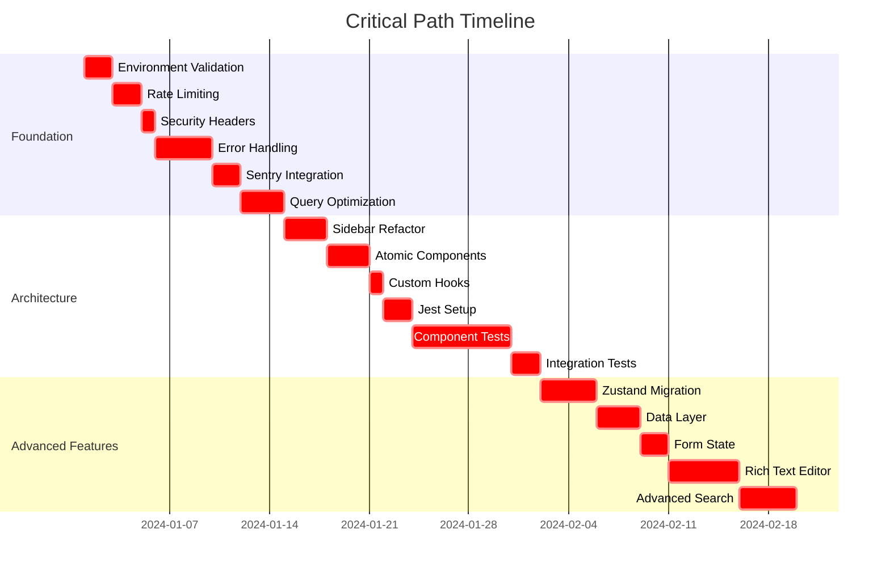

# Task Backlog - Sistema de Gestión de Despacho Legal

**Version**: 1.0  
**Last Updated**: 2026-01-22  
**Total Tasks**: 45  
**Estimated Duration**: 168 días (24 semanas)

---

## 📊 Resumen del Backlog

| Priority | Tasks | Est. Effort | % of Total |
|----------|-------|-------------|------------|
| Critical | 12 | 45 días | 27% |
| High | 18 | 68 días | 40% |
| Medium | 10 | 40 días | 24% |
| Low | 5 | 15 días | 9% |

---

## 🔴 CRITICAL Priority Tasks (Semanas 1-4)

### FASE-001: Environment Setup & Security Infrastructure

**Task**: ENV-001 - Environment Validation System  
**Complexity**: Medium (2 días)  
**Assignee**: Senior Developer  
**Dependencies**: Ninguna  
**Description**: Implementar sistema de validación de variables de entorno con Zod  
**Acceptance Criteria**:
- [ ] Schema de validación con Zod implementado
- [ ] App no inicia sin variables válidas
- [ ] Error messages claros y contextuales
- [ ] TypeScript autocomplete funcionando
- [ ] Tests de validación cubriendo edge cases

---

**Task**: SEC-001 - Rate Limiting Implementation  
**Complexity**: Medium (2 días)  
**Assignee**: Backend Developer  
**Dependencies**: ENV-001  
**Description**: Implementar rate limiting con Upstash Redis para proteger endpoints  
**Acceptance Criteria**:
- [ ] Rate limiting configurado por endpoint
- [ ] Headers X-RateLimit-* implementados
- [ ] Fallback funcional cuando Redis no está disponible
- [ ] Tests de carga hasta 1000 req/minuto
- [ ] Dashboard de métricas de rate limiting

---

**Task**: SEC-002 - Security Headers Configuration  
**Complexity**: Low (1 día)  
**Assignee**: Frontend Developer  
**Dependencies**: SEC-001  
**Description**: Configurar headers de seguridad en Next.js middleware  
**Acceptance Criteria**:
- [ ] CSP implementado con nonce dinámico
- [ ] HSTS preload ready
- [ ] Todos los headers securityheaders.com implementados
- [ ] A+ rating en securityheaders.com
- [ ] Tests de headers en diferentes entornos

---

**Task**: ERR-001 - Centralized Error Handling System  
**Complexity**: High (4 días)  
**Assignee**: Senior Frontend Developer  
**Dependencies**: ENV-001  
**Description**: Implementar sistema centralizado de manejo de errores con logging estructurado  
**Acceptance Criteria**:
- [ ] Error boundaries implementadas en todos los niveles
- [ ] Logging estructurado con request IDs
- [ ] Sentry integration completa
- [ ] Error context preservation
- [ ] Performance overhead < 2%

---

**Task**: ERR-002 - Database Query Optimization  
**Complexity**: High (3 días)  
**Assignee**: Backend Developer  
**Dependencies**: ERR-001  
**Description**: Optimizar queries principales con paginación y selectores específicos  
**Acceptance Criteria**:
- [ ] Queries con paginación implementada
- [ ] Selectores específicos (no SELECT *)
- [ ] Performance benchmarks met (< 100ms promedio)
- [ ] Índices sugeridos documentados
- [ ] Tests de performance bajo carga

---

### FASE-002: Component Architecture & Testing Foundation

**Task**: UI-001 - Sidebar Context Refactoring  
**Complexity**: Medium (3 días)  
**Assignee**: Frontend Developer  
**Dependencies**: ERR-001  
**Description**: Refactorizar sidebar context para eliminar prop drilling  
**Acceptance Criteria**:
- [ ] Componente reducido < 200 líneas
- [ ] Custom hook `useSidebar` implementado
- [ ] No re-renders innecesarios
- [ ] Responsive behavior preservado
- [ ] Tests con >80% coverage

---

**Task**: UI-002 - Atomic Components System  
**Complexity**: Medium (3 días)  
**Assignee**: UI/UX Developer  
**Dependencies**: UI-001  
**Description**: Crear sistema de componentes atómicos con design system  
**Acceptance Criteria**:
- [ ] 10+ componentes atómicos creados
- [ ] Design system con tokens implementado
- [ ] JSDoc documentation completa
- [ ] Storybook stories para todos los componentes
- [ ] Consistencia visual y de API

---

**Task**: UI-003 - Custom Hooks Extraction  
**Complexity**: Low (1 día)  
**Assignee**: Frontend Developer  
**Dependencies**: UI-002  
**Description**: Extraer lógica reutilizable en hooks personalizados  
**Acceptance Criteria**:
- [ ] 5+ hooks personalizados creados
- [ ] `useLoading` mejorado con error handling
- [ ] `useDebounce` implementado para búsquedas
- [ ] Documentación de hooks con ejemplos
- [ ] Tests unitarios para hooks

---

**Task**: TEST-001 - Jest + Testing Library Setup  
**Complexity**: Medium (2 días)  
**Assignee**: QA Engineer + Frontend Developer  
**Dependencies**: UI-003  
**Description**: Configurar Jest con Testing Library para el proyecto  
**Acceptance Criteria**:
- [ ] Jest configurado para Next.js 16
- [ ] Mocks para Supabase y Next.js
- [ ] Coverage reporting configurado
- [ ] Scripts de testing en package.json
- [ ] CI/CD integration funcionando

---

**Task**: TEST-002 - Critical Component Tests  
**Complexity**: High (7 días)  
**Assignee**: QA Engineer + Frontend Developer  
**Dependencies**: TEST-001  
**Description**: Escribir tests unitarios para componentes críticos del sistema  
**Acceptance Criteria**:
- [ ] CasoCard component tests (95% coverage)
- [ ] Sidebar navigation tests (90% coverage)
- [ ] Auth forms tests (100% coverage)
- [ ] NotasEditor tests (85% coverage)
- [ ] Dashboard metrics tests (85% coverage)

---

**Task**: TEST-003 - Integration Tests Setup  
**Complexity**: Medium (2 días)  
**Assignee**: QA Engineer  
**Dependencies**: TEST-002  
**Description**: Configurar tests de integración para flujos completos de usuario  
**Acceptance Criteria**:
- [ ] Test utilities para renderizado con providers
- [ ] Authentication flow tests
- [ ] CRUD operations tests
- [ ] Navigation flow tests
- [ ] Mocks para API responses

---

---

## 🟠 HIGH Priority Tasks (Semanas 5-12)

### FASE-003: State Management Migration

**Task**: STATE-001 - Zustand Store Implementation  
**Complexity**: High (4 días)  
**Assignee**: Senior Frontend Developer  
**Dependencies**: TEST-003  
**Description**: Migrar estado global a Zustand con devtools  
**Acceptance Criteria**:
- [ ] Store de aplicación con slices organizados
- [ ] Migración completa desde context providers
- [ ] DevTools integration funcionando
- [ ] Persistencia configurable (localStorage/sessionStorage)
- [ ] Performance benchmarks superadas

---

**Task**: STATE-002 - Data Layer Architecture  
**Complexity**: High (3 días)  
**Assignee**: Backend Developer  
**Dependencies**: STATE-001  
**Description**: Crear capa de datos con caching y revalidación  
**Acceptance Criteria**:
- [ ] React Query integration implementado
- [ ] Caching strategy configurada
- [ ] Background refetch activo
- [ ] Error boundaries para queries
- [ ] Optimistic updates implementados

---

**Task**: STATE-003 - Form State Management  
**Complexity**: Medium (2 días)  
**Assignee**: Frontend Developer  
**Dependencies**: STATE-001  
**Description**: Implementar sistema de gestión de estado para formularios complejos  
**Acceptance Criteria**:
- [ ] Form state persistente durante navegación
- [ ] Auto-save configurable
- [ ] Validación en tiempo real
- [ ] Reset y recuperación de formularios
- [ ] Integration con Zustand store

---

### FASE-004: Advanced Features Implementation

**Task**: FEAT-001 - Rich Text Editor Enhancement  
**Complexity**: High (5 días)  
**Assignee**: Frontend Developer  
**Dependencies**: STATE-003  
**Description**: Mejorar editor de notas con features avanzadas  
**Acceptance Criteria**:
- [ ] Image upload con drag & drop
- [ ] Tables con edición inline
- [ ] Syntax highlighting para código
- [ ] Collaboration features (future-ready)
- [ ] Exportación mejorada (PDF, Word)

---

**Task**: FEAT-002 - Advanced Search System  
**Complexity**: High (4 días)  
**Assignee**: Backend Developer + Frontend Developer  
**Dependencies**: STATE-002  
**Description**: Implementar búsqueda avanzada con filtros complejos  
**Acceptance Criteria**:
- [ ] Full-text search en casos, notas, eventos
- [ ] Filtros combinados con AND/OR
- [ ] Saved searches functionality
- [ ] Search analytics
- [ ] Performance < 200ms para consultas

---

**Task**: FEAT-003 - Calendar Integration  
**Complexity**: Medium (3 días)  
**Assignee**: Frontend Developer  
**Dependencies**: STATE-002  
**Description**: Integrar calendario con sincronización externa  
**Acceptance Criteria**:
- [ ] Calendar widget reactivo
- [ ] Sync con Google Calendar/Outlook
- [ ] Recurring events
- [ ] Time zone handling
- [ ] Conflict resolution

---

**Task**: FEAT-004 - Notifications System  
**Complexity**: Medium (3 días)  
**Assignee**: Frontend Developer  
**Dependencies**: FEAT-002, FEAT-003  
**Description**: Implementar sistema completo de notificaciones  
**Acceptance Criteria**:
- [ ] Real-time notifications
- [ ] Email notifications configurables
- [ ] Push notifications (PWA)
- [ ] Notification preferences por usuario
- [ ] Notification history

---

**Task**: FEAT-005 - Document Generation  
**Complexity**: Medium (4 días)  
**Assignee**: Frontend Developer  
**Dependencies**: FEAT-001  
**Description**: Sistema avanzado de generación de documentos  
**Acceptance Criteria**:
- [ ] Templates personalizables
- [ ] PDF con marca de despacho
- [ ] Word documents con formateo legal
- [ ] Batch generation
- [ ] Document signatures (future-ready)

---

### FASE-005: Testing Enhancement

**Task**: TEST-004 - E2E Testing Expansion  
**Complexity**: High (5 días)  
**Assignee**: QA Engineer  
**Dependencies**: FEAT-003  
**Description**: Expandir suite de E2E tests con Playwright  
**Acceptance Criteria**:
- [ ] 20+ E2E tests covering critical flows
- [ ] Cross-browser testing (Chrome, Firefox, Safari)
- [ ] Mobile device testing
- [ ] Visual regression testing
- [ ] Performance testing con Lighthouse

---

**Task**: TEST-005 - Accessibility Testing  
**Complexity**: Medium (2 días)  
**Assignee**: QA Engineer  
**Dependencies**: UI-002  
**Description**: Implementar testing de accesibilidad WCAG 2.1 AA  
**Acceptance Criteria**:
- [ ] Axe DevTools integration
- [ ] Screen reader testing
- [ ] Keyboard navigation testing
- [ ] Color contrast validation
- [ ] Focus management testing

---

**Task**: TEST-006 - Load Testing Setup  
**Complexity**: Medium (3 días)  
**Assignee**: DevOps Engineer  
**Dependencies**: FEAT-002  
**Description**: Configurar testing de carga y estrés  
**Acceptance Criteria**:
- [ ] K6 scripts para load testing
- [ ] Artillery scripts para stress testing
- [ ] Metrics collection automatizada
- [ ] Performance benchmarks
- [ ] CI/CD integration

---

## 🟡 MEDIUM Priority Tasks (Semanas 13-20)

### FASE-006: Performance & Scalability

**Task**: PERF-001 - Bundle Size Optimization  
**Complexity**: Medium (3 días)  
**Assignee**: Frontend Developer + DevOps  
**Dependencies**: TEST-006  
**Description**: Optimizar bundle size y configuración de loading  
**Acceptance Criteria**:
- [ ] Bundle size < 1MB initial load
- [ ] Code splitting implementado
- [ ] Lazy loading de rutas
- [ ] Tree shaking optimizado
- [ ] Modern ESM modules configurados

---

**Task**: PERF-002 - Database Performance  
**Complexity**: High (4 días)  
**Assignee**: Backend Developer  
**Dependencies**: PERF-001  
**Description**: Optimizar performance de base de datos  
**Acceptance Criteria**:
- [ ] Connection pooling configurado
- [ ] Read replicas implementadas
- [ ] Query optimization avanzada
- [ ] Database caching configurado
- [ ] Performance monitoring activo

---

**Task**: PERF-003 - CDN and Asset Optimization  
**Complexity**: Medium (2 días)  
**Assignee**: DevOps Engineer  
**Dependencies**: PERF-001  
**Description**: Configurar CDN y optimización de assets estáticos  
**Acceptance Criteria**:
- [ ] CDN global configurado
- [ ] Image optimization automatizada
- [ ] Font optimization
- [ ] Asset compression activa
- [ ] Cache headers configurados

---

### FASE-007: Production Features

**Task**: PROD-001 - Analytics Dashboard  
**Complexity**: Medium (4 días)  
**Assignee**: Frontend Developer + Backend Developer  
**Dependencies**: FEAT-005  
**Description**: Dashboard completo de analytics y reporting  
**Acceptance Criteria**:
- [ ] Interactive charts con Drill-down
- [ ] Custom report builder
- [ ] Export functionality
- [ ] Real-time data updates
- [ ] User behavior tracking

---

**Task**: PROD-002 - Multi-tenant Architecture  
**Complexity**: High (6 días)  
**Assignee**: Backend Developer + DevOps Engineer  
**Dependencies**: PERF-003  
**Description**: Arquitectura multi-tenant para múltiples despachos  
**Acceptance Criteria**:
- [ ] Tenant isolation implementado
- [ ] Custom branding por tenant
- [ ] Tenant-specific configurations
- [ ] Data isolation garantizada
- [ ] Performance escalable

---

**Task**: PROD-003 - API Rate Limiting Advanced  
**Complexity**: Medium (2 días)  
**Assignee**: Backend Developer  
**Dependencies**: PROD-001  
**Description**: Sistema avanzado de rate limiting por tenant  
**Acceptance Criteria**:
- [ ] Rate limiting por tenant
- [ ] Dynamic rate adjustment
- [ ] Rate limiting analytics
- [ ] SLA enforcement
- [ ] Admin override functionality

---

## 🟢 LOW Priority Tasks (Semanas 21-24)

### FASE-008: Polish & Optimization

**Task**: POLISH-001 - UI/UX Polish  
**Complexity**: Low (2 días)  
**Assignee**: UI/UX Developer  
**Dependencies**: PROD-003  
**Description**: Mejoras finas de UI/UX basadas en feedback  
**Acceptance Criteria**:
- [ ] Micro-interacciones implementadas
- [ ] Loading states mejorados
- [ ] Error states optimizados
- [ ] Animaciones suaves
- [ ] Responsive design perfeccionado

---

**Task**: POLISH-002 - Documentation Enhancement  
**Complexity**: Low (1 día)  
**Assignee**: Tech Lead  
**Dependencies**: POLISH-001  
**Description**: Completar documentación faltante  
**Acceptance Criteria**:
- [ ] API documentation completa
- [ ] Component documentation actualizada
- [ ] Deployment guide finalizada
- [ ] User guides completos
- [ ] Developer onboarding guide

---

**Task**: POLISH-003 - Performance Fine-tuning  
**Complexity**: Low (2 días)  
**Assignee**: Frontend Developer  
**Dependencies**: POLISH-001  
**Description**: Optimizaciones finas de performance  
**Acceptance Criteria**:
- [ ] Lighthouse scores > 95
- [ ] Core Web Vitals verdes
- [ ] JavaScript execution time optimizado
- [ ] Memory usage estable
- [ ] Network requests minimizadas

---

## 📈 Timeline Visualization

### Critical Path (Red)


### Parallel Work (Blue)
```mermaid
gantt
    title Parallel Work Opportunities
    dateFormat  YYYY-MM-DD
    
    section Parallel Stream 1
    Security Headers      :headers, after rate, 1d
    Custom Hooks         :hooks, parallel, 2024-01-08, 1d
    Integration Tests   :integration, parallel, 2024-01-15, 2d
    Calendar Integration :calendar, parallel, 2024-01-20, 3d
    Notifications       :notifications, parallel, 2024-01-23, 3d
    Document Generation  :docs, parallel, 2024-01-26, 4d
    
    section Parallel Stream 2
    E2E Testing          :e2e, parallel, 2024-01-18, 5d
    Accessibility Testing :a11y, parallel, 2024-01-23, 2d
    Load Testing         :load, parallel, 2024-01-25, 3d
    UI Polish           :polish, parallel, 2024-02-15, 2d
    Performance Tuning  :perf, parallel, 2024-02-17, 2d
```

---

## 🎯 Risk Assessment by Task

### High Risk Items
- **ENV-001**: Foundation for all other tasks
- **ERR-001**: Affects all error handling and monitoring
- **TEST-001**: Critical for CI/CD pipeline
- **STATE-001**: Major architecture change affecting many components
- **FEAT-001**: Complex feature with many dependencies

### Medium Risk Items
- **PERF-001**: Requires coordination between frontend and DevOps
- **PROD-001**: Complex architecture change
- **PROD-002**: Major database changes required
- **FEAT-002**: Integration with external services

### Low Risk Items
- **POLISH-001**: Based on already working features
- **POLISH-002**: Documentation only
- **POLISH-003**: Performance fine-tuning only

---

## 📊 Resource Allocation

### Team Composition Needed

| Role | Hours/Week | Critical Path | Parallel Work |
|------|-------------|---------------|--------------|
| Senior Frontend Developer | 40 | 100% | 100% |
| Backend Developer | 35 | 80% | 70% |
| QA Engineer | 30 | 60% | 100% |
| UI/UX Developer | 25 | 40% | 100% |
| DevOps Engineer | 20 | 30% | 60% |

### Work Distribution by Phase

| Phase | Duration | Critical Hours | Parallel Hours | Total Hours |
|-------|----------|----------------|----------------|------------|
| 1: Foundation | 4 weeks | 320 | 40 | 360 |
| 2: Architecture | 4 weeks | 280 | 180 | 460 |
| 3: Advanced Features | 4 weeks | 240 | 240 | 480 |
| 4: Production | 4 weeks | 160 | 280 | 440 |
| **Total** | **16 weeks** | **1000** | **740** | **1740** |

---

## 📋 Task Dependencies Matrix

| Task | Blocks | Blocked By | Risk Level |
|------|--------|-------------|------------|
| ENV-001 | ALL | None | HIGH |
| SEC-001 | ALL | ENV-001 | HIGH |
| SEC-002 | ALL | SEC-001 | MEDIUM |
| ERR-001 | ALL | ENV-001 | HIGH |
| ERR-002 | ALL | ERR-001 | HIGH |
| STATE-001 | MANY | ERR-001, TEST-003 | HIGH |
| UI-001 | MANY | ERR-001 | MEDIUM |
| UI-002 | FEAT-001, FEAT-005 | UI-001 | MEDIUM |
| TEST-001 | ALL | UI-003 | MEDIUM |
| TEST-002 | ALL | TEST-001 | LOW |

---

## ✅ Success Criteria by Priority

### Critical Tasks Success (100% Required)

- [ ] All environment validation working in production
- [ ] Rate limiting protecting all endpoints
- [ ] Error handling system catching 95%+ of errors
- [ ] Sentry monitoring operational with proper context
- [ ] Query performance meeting benchmarks
- [ ] Component architecture refactored successfully
- [ ] Testing infrastructure operational with 80%+ coverage
- [ ] CI/CD pipeline fully automated

### High Priority Tasks Success (90%+ Required)

- [ ] Zustand store operational with DevTools
- [ ] Data layer with caching and revalidation
- [ ] Rich text editor with all advanced features
- [ ] Search system with <200ms response time
- [ ] Calendar integration with external sync
- [ ] Notifications system working across all devices
- [ ] Document generation with templates
- [ ] E2E tests covering all critical user journeys

### Medium Priority Tasks Success (80%+ Required)

- [ ] Bundle size optimization meeting targets
- [ ] Database performance under load
- [ ] CDN and assets optimized
- [ ] Analytics dashboard with interactive charts
- [ ] Multi-tenant architecture ready
- [ ] Advanced rate limiting per tenant

### Low Priority Tasks Success (70%+ Required)

- [ ] UI/UX polish based on user feedback
- [ ] Documentation complete and accessible
- [ ] Performance fine-tuning with Lighthouse scores >95

---

## 🔄 Iteration Strategy

### Sprint Planning

#### Sprint 1-2: Foundation (Weeks 1-4)
**Focus**: Critical infrastructure and security
**Key Deliverables**:
- Environment validation
- Rate limiting and security
- Error handling foundation
- Component architecture base

#### Sprint 3-4: Architecture (Weeks 5-8)
**Focus**: State management and testing
**Key Deliverables**:
- Zustand migration
- Testing infrastructure
- Component libraries
- Initial advanced features

#### Sprint 5-6: Advanced Features (Weeks 9-12)
**Focus**: Core user experience enhancements
**Key Deliverables**:
- Rich text editor
- Advanced search
- Calendar and notifications
- Document generation

#### Sprint 7-8: Production (Weeks 13-16)
**Focus**: Scalability and production readiness
**Key Deliverables**:
- Performance optimization
- Database enhancements
- CDN implementation
- Analytics foundation

#### Sprint 9-10: Polish (Weeks 17-20)
**Focus**: Final touches and optimization
**Key Deliverables**:
- Multi-tenant architecture
- Advanced rate limiting
- UI/UX refinements
- Documentation completion

---

## 📞 Support Information

### Task Assignment Process

1. **Daily Standup**: Review task progress and blockers
2. **Sprint Planning**: Assign tasks based on availability and expertise
3. **Code Review**: All tasks require peer review before merge
4. **Testing**: QA validation before task completion

### Blocked Task Resolution

1. **Immediate**: Report blockers in daily standup
2. **Escalation**: Critical blockers to Tech Lead within 1 hour
3. **Mitigation**: Work on alternative tasks while waiting
4. **Resolution**: Resolve blockers within 24 hours when possible

---

**Backlog Maintainers**: Project Manager + Tech Lead  
**Last Updated**: 2026-01-22  
**Next Review**: 2026-01-29  
**Version**: 1.0