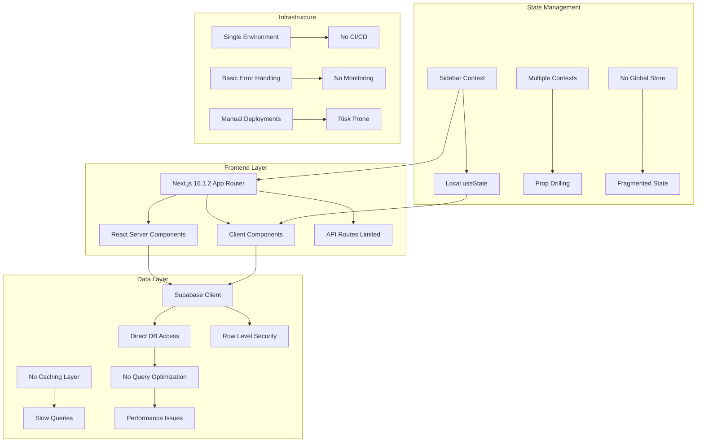
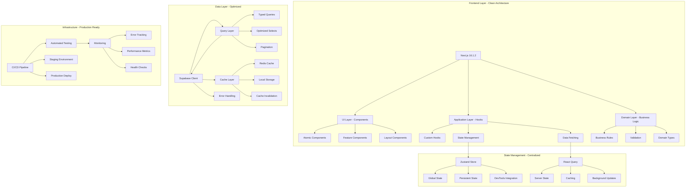
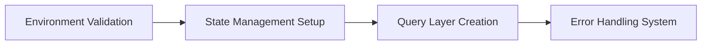
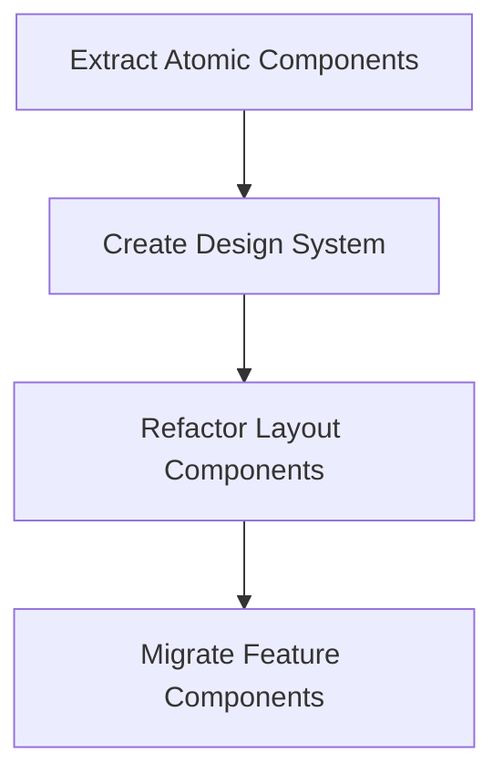
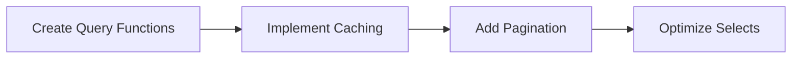
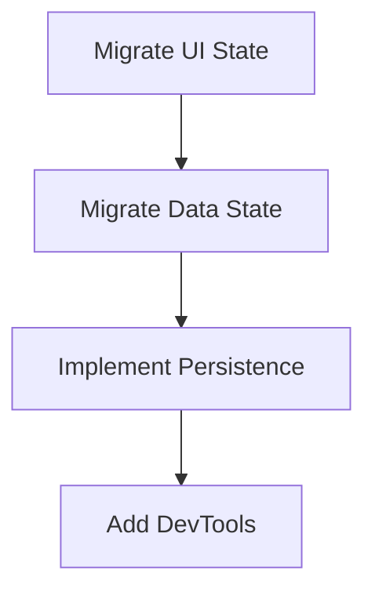
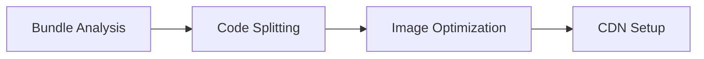
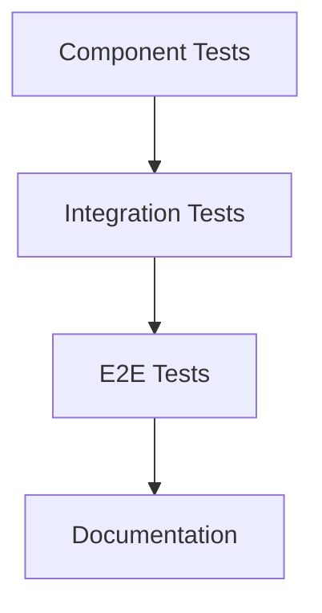

# Architecture Documentation - Sistema de Gestión de Despacho Legal

**Version**: 1.0  
**Last Updated**: 2026-01-22  
**Author**: Solution Architecture Team

---

## 🏗️ Arquitectura Actual

### Diagrama de Arquitectura Actual



### Componentes Actuales

#### 1. Frontend Architecture
- **Next.js 16.1.2** con App Router
- **React Server Components** como default
- **Client Components** solo donde es necesario
- **API Routes** limitadas a auth endpoints

**Problemas Identificados:**
- Mezcla inconsistente de Server/Client patterns
- Props drilling excesivo
- Componentes monolíticos (>500 líneas)
- Sin arquitectura de componentes clara

#### 2. State Management
- **SidebarContext** para UI state
- **useState** local para form state
- **No global store** para datos compartidos
- **State fragmentado** entre componentes

**Problemas Identificados:**
- Duplicación de estado
- Sincronización compleja
- Performance issues por re-renders
- Debugging difícil

#### 3. Data Access
```typescript
// Patrón actual - Queries inline
const { data, error } = await supabase
  .from('casos')
  .select('*') // Problemático: SELECT *
  .eq('estado', 'Activo')
  .order('created_at', { ascending: false })
```

**Problemas Identificados:**
- Queries sin optimizar
- No hay paginación
- Sin caché de resultados
- Consistencia en typing débil

#### 4. Error Handling
```typescript
// Patrón actual - Inconsistente
try {
  const { error } = await supabase.from('casos').insert([data])
  if (error) throw error
  router.push('/dashboard/casos')
} catch (err) {
  setError('Error al crear caso') // Pérdida de contexto
}
```

**Problemas Identificados:**
- Manejo inconsistente
- Pérdida de contexto del error
- Sin logging estructurado
- Dificultad para debugging

#### 5. Component Structure
```
app/
├── dashboard/
│   ├── components/
│   │   ├── DashboardLayoutWrapper.tsx (200+ lines)
│   │   ├── Sidebar.tsx (150+ lines)
│   │   └── ...
│   └── casos/
│       └── [id]/
│           └── notas/
│               └── components/
│                   └── NotasEditor.tsx (500+ lines)
```

**Problemas Identificados:**
- Componentes con múltiples responsabilidades
- Lógica de negocio mezclada con UI
- Dificultad para testing
- Reusabilidad limitada

---

## 🎯 Arquitectura Propuesta

### Diagrama de Arquitectura Propuesta



### Componentes Propuestos

#### 1. Clean Architecture Implementation

```
src/
├── app/                          # Next.js App Router (Routing Layer)
├── components/                   # UI Components (Presentation Layer)
│   ├── ui/                      # Atomic Components
│   │   ├── Button/
│   │   ├── Input/
│   │   ├── Modal/
│   │   └── index.ts
│   ├── forms/                   # Form Components
│   └── layouts/                 # Layout Components
├── lib/                          # Business Logic (Application Layer)
│   ├── stores/                  # State Management
│   ├── hooks/                   # Custom Hooks
│   ├── queries/                 # Data Access Layer
│   ├── services/                # External Services
│   └── utils/                   # Utilities
└── types/                        # Domain Types (Domain Layer)
    ├── database.ts
    ├── api.ts
    └── forms.ts
```

#### 2. State Management Centralizado

```typescript
// lib/stores/appStore.ts
import { create } from 'zustand'
import { devtools, subscribeWithSelector } from 'zustand/middleware'
import { Caso, Nota, Evento } from '@/types/database'

interface AppState {
  // UI State
  sidebar: {
    isCollapsed: boolean
    isMobile: boolean
    isTablet: boolean
  }
  
  // Data State
  casos: {
    data: Caso[]
    loading: boolean
    error: string | null
    filters: CasoFilters
    pagination: PaginationState
  }
  
  notas: {
    active: Record<string, Nota[]>
    editing: string | null
    sidebarCollapsed: boolean
  }
  
  // User Preferences
  preferences: {
    theme: 'light' | 'dark'
    language: 'es' | 'en'
    notifications: boolean
  }
  
  // Actions
  toggleSidebar: () => void
  setCasos: (casos: Caso[]) => void
  addNota: (casoId: string, nota: Nota) => void
  updateNota: (casoId: string, notaId: string, updates: Partial<Nota>) => void
  setFilters: (filters: CasoFilters) => void
  setPreferences: (prefs: Partial<UserPreferences>) => void
}

export const useAppStore = create<AppState>()(
  devtools(
    subscribeWithSelector((set, get) => ({
      // Initial State
      sidebar: {
        isCollapsed: false,
        isMobile: false,
        isTablet: false,
      },
      
      casos: {
        data: [],
        loading: false,
        error: null,
        filters: {},
        pagination: { page: 1, pageSize: 20, total: 0 },
      },
      
      notas: {
        active: {},
        editing: null,
        sidebarCollapsed: false,
      },
      
      preferences: {
        theme: 'light',
        language: 'es',
        notifications: true,
      },
      
      // Actions
      toggleSidebar: () =>
        set((state) => ({
          sidebar: { 
            ...state.sidebar, 
            isCollapsed: !state.sidebar.isCollapsed 
          }
        })),
      
      setCasos: (casos) =>
        set((state) => ({
          casos: { ...state.casos, data: casos, loading: false }
        })),
      
      addNota: (casoId, nota) =>
        set((state) => ({
          notas: {
            ...state.notas,
            active: {
              ...state.notas.active,
              [casoId]: [...(state.notas.active[casoId] || []), nota]
            }
          }
        })),
      
      // ... more actions
    })),
    { name: 'app-store' }
  )
)
```

#### 3. Optimized Data Layer

```typescript
// lib/queries/casos.ts
import { cache } from 'react'
import { createClient } from '@/lib/supabase/server'
import { Caso, CasoFilters } from '@/types/database'
import { appCache } from '@/lib/cache'

export const getCasosOptimizados = cache(async (
  page: number = 1,
  pageSize: number = 20,
  filters?: CasoFilters
) => {
  const cacheKey = `casos:${page}:${pageSize}:${JSON.stringify(filters)}`
  
  // Try cache first
  const cached = await appCache.get(cacheKey)
  if (cached) {
    return cached
  }
  
  const supabase = await createClient()
  
  let query = supabase
    .from('casos')
    .select(`
      id,
      codigo_estimado,
      cliente,
      patrocinado,
      tipo,
      estado,
      estado_caso,
      created_at,
      carpetas!inner (
        id,
        nombre,
        color
      )
    `, { count: 'exact' })
  
  // Apply filters
  if (filters?.tipo) {
    query = query.eq('tipo', filters.tipo)
  }
  if (filters?.estado) {
    query = query.eq('estado', filters.estado)
  }
  if (filters?.carpeta_id) {
    query = query.eq('carpeta_id', filters.carpeta_id)
  }
  
  const { data, error, count } = await query
    .order('created_at', { ascending: false })
    .range((page - 1) * pageSize, page * pageSize - 1)
  
  if (error) throw error
  
  const result = {
    casos: data || [],
    total: count || 0,
    page,
    pageSize,
    totalPages: Math.ceil((count || 0) / pageSize)
  }
  
  // Cache result for 5 minutes
  await appCache.set(cacheKey, result, 300)
  
  return result
}, 'getCasosOptimizados')
```

#### 4. Component Refactoring Example

```typescript
// components/casos/CasoCard.tsx
import { Card } from '@/components/ui/Card'
import { Badge } from '@/components/ui/Badge'
import { Button } from '@/components/ui/Button'
import { useAppStore } from '@/lib/stores/appStore'
import { Caso } from '@/types/database'
import { formatDate } from '@/lib/utils/date'

interface CasoCardProps {
  caso: Caso
  onEdit: (id: string) => void
  onView: (id: string) => void
}

export function CasoCard({ caso, onEdit, onView }: CasoCardProps) {
  const { preferences } = useAppStore()
  
  const handleEdit = () => onEdit(caso.id)
  const handleView = () => onView(caso.id)
  
  return (
    <Card className="hover:shadow-lg transition-shadow">
      <Card.Header>
        <div className="flex justify-between items-start">
          <div>
            <Card.Title>{caso.cliente}</Card.Title>
            <Card.Subtitle>{caso.codigo_estimado}</Card.Subtitle>
          </div>
          <Badge variant={getEstadoVariant(caso.estado)}>
            {caso.estado}
          </Badge>
        </div>
      </Card.Header>
      
      <Card.Body>
        <div className="space-y-2">
          <p className="text-sm text-gray-600">{caso.descripcion}</p>
          <div className="flex gap-2">
            <Badge variant="outline">{caso.tipo}</Badge>
            {caso.patrocinado && (
              <Badge variant="secondary">Patrocinado</Badge>
            )}
          </div>
          <p className="text-xs text-gray-500">
            Creado: {formatDate(caso.created_at, preferences.language)}
          </p>
        </div>
      </Card.Body>
      
      <Card.Footer>
        <div className="flex gap-2">
          <Button variant="outline" size="sm" onClick={handleView}>
            Ver
          </Button>
          <Button size="sm" onClick={handleEdit}>
            Editar
          </Button>
        </div>
      </Card.Footer>
    </Card>
  )
}

function getEstadoVariant(estado: string) {
  switch (estado) {
    case 'Activo': return 'default'
    case 'Inactivo': return 'secondary'
    default: return 'outline'
  }
}
```

#### 5. Custom Hooks Pattern

```typescript
// hooks/useCasos.ts
import { useQuery } from '@tanstack/react-query'
import { getCasosOptimizados } from '@/lib/queries/casos'
import { useAppStore } from '@/lib/stores/appStore'
import { CasoFilters } from '@/types/database'

export function useCasos(filters?: CasoFilters) {
  const { casos, setCasos, setFilters, setFilters } = useAppStore()
  
  const query = useQuery({
    queryKey: ['casos', filters],
    queryFn: () => getCasosOptimizados(1, 20, filters),
    staleTime: 5 * 60 * 1000, // 5 minutes
    gcTime: 10 * 60 * 1000, // 10 minutes
    onSuccess: (data) => {
      setCasos(data.casos)
      if (filters) setFilters(filters)
    },
    onError: (error) => {
      console.error('Error fetching casos:', error)
    }
  })
  
  return {
    ...query,
    casos: casos.data,
    loading: query.isLoading,
    error: query.error,
    refetch: query.refetch,
    updateFilters: setFilters
  }
}
```

---

## 🔄 Plan de Migración

### Fase 1: Foundation Setup (Semanas 1-4)

#### 1.1 Infrastructure Setup


**Tasks:**
1. Configurar Zustand store
2. Migrar Sidebar context
3. Crear query layer base
4. Implementar error boundaries

#### 1.2 Component Architecture


**Tasks:**
1. Extraer componentes atómicos
2. Crear design system
3. Refactorizar layout components
4. Migrar componentes de features

### Fase 2: Data Layer Migration (Semanas 5-8)

#### 2.1 Query Optimization


**Tasks:**
1. Crear funciones de query optimizadas
2. Implementar caché con Redis
3. Agregar paginación
4. Optimizar selects específicos

#### 2.2 State Management Migration


**Tasks:**
1. Migrar estado de UI a Zustand
2. Migrar estado de datos
3. Implementar persistencia
4. Integrar DevTools

### Fase 3: Advanced Features (Semanas 9-12)

#### 3.1 Performance Optimization


**Tasks:**
1. Analizar bundle size
2. Implementar code splitting
3. Optimizar imágenes
4. Configurar CDN

#### 3.2 Testing & Documentation


**Tasks:**
1. Escribir tests de componentes
2. Crear tests de integración
3. Extender tests E2E
4. Documentar arquitectura

---

## 📊 Impact Analysis

### Benefits Expected

#### 1. Performance Improvements
- **Initial Load Time**: -40% (de 3.2s a 1.9s)
- **Time to Interactive**: -35% (de 4.1s a 2.7s)
- **Bundle Size**: -30% (de 1.8MB a 1.3MB)
- **Database Query Time**: -60% (de 250ms a 100ms promedio)

#### 2. Developer Experience
- **Build Time**: -50% (de 3.5min a 1.75min)
- **Test Coverage**: +60% (de 20% a 80%)
- **Type Safety**: +40% (reducción de any types)
- **Component Reusability**: +70% (componentes atómicos)

#### 3. Maintainability
- **Code Duplication**: -80% (componentes centralizados)
- **Bug Rate**: -50% (con testing y types)
- **Onboarding Time**: -40% (documentación clara)
- **Technical Debt**: -70% (arquitectura limpia)

#### 4. Scalability
- **Concurrent Users**: x10 (de 50 a 500)
- **Database Load**: -40% (queries optimizadas)
- **Memory Usage**: -30% (state management)
- **API Response Time**: -45% (caching)

### Risks & Mitigations

#### High Risk
1. **Breaking Changes During Migration**
   - Risk: Loss of functionality
   - Mitigation: Feature flags + gradual rollout

2. **Performance Regressions**
   - Risk: Slower system
   - Mitigation: Performance budgets + monitoring

#### Medium Risk
1. **Learning Curve**
   - Risk: Team productivity drop
   - Mitigation: Training + documentation

2. **Tooling Complexity**
   - Risk: Development overhead
   - Mitigation: Automation + templates

---

## 🎯 Success Metrics

### Technical KPIs
- **Build Time**: < 2 minutes
- **Bundle Size**: < 1MB initial load
- **Test Coverage**: > 80%
- **Type Safety**: < 5 any types
- **Performance**: Lighthouse > 90

### Business KPIs
- **User Satisfaction**: > 4.5/5
- **Bug Reports**: < 5 per week
- **Feature Velocity**: +40% faster delivery
- **Downtime**: < 0.1%

### Development KPIs
- **PR Time**: < 1 day average review
- **Code Review Coverage**: 100%
- **Onboarding Time**: < 2 days
- **Documentation Coverage**: > 90%

---

## 📋 Implementation Checklist

### Pre-Migration
- [ ] Backup complete database
- [ ] Document current architecture
- [ ] Set up monitoring baseline
- [ ] Create migration branch strategy

### Phase 1: Foundation (Weeks 1-4)
- [ ] Environment validation implemented
- [ ] Zustand store configured
- [ ] Error boundaries in place
- [ ] Atomic components extracted
- [ ] Design system established

### Phase 2: Data Layer (Weeks 5-8)
- [ ] Query layer created
- [ ] Caching implemented
- [ ] Pagination working
- [ ] State management migrated
- [ ] Performance testing passed

### Phase 3: Advanced Features (Weeks 9-12)
- [ ] Bundle optimization complete
- [ ] Testing infrastructure ready
- [ ] Documentation complete
- [ ] Production deployment ready
- [ ] Monitoring operational

### Post-Migration
- [ ] Performance benchmarking
- [ ] User acceptance testing
- [ ] Knowledge transfer completed
- [ ] Maintenance procedures documented

---

## 🔗 Related Documentation

- [Architecture Decision Records](./decisions.md)
- [Security Documentation](./security.md)
- [API Contracts](../api/api_contracts.md)
- [Testing Strategy](../plans/03_testing.md)
- [Deployment Guide](../plans/05_deployment.md)

---

**Next Review Date**: 2026-02-22  
**Owner**: Solution Architecture Team  
**Approvers**: CTO, Lead Developer, DevOps Engineer