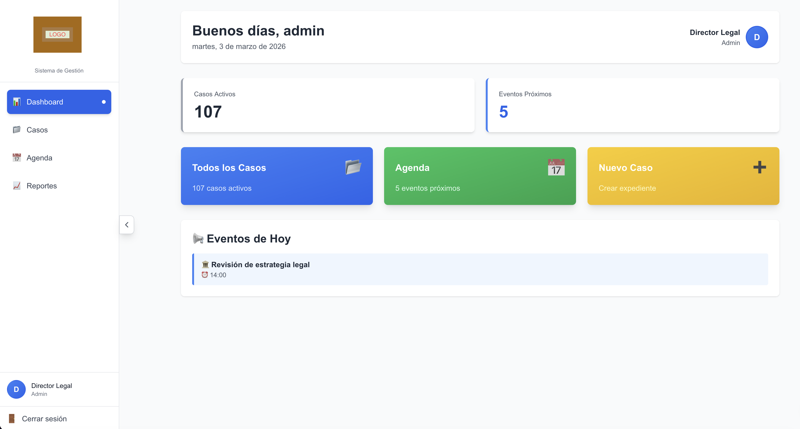
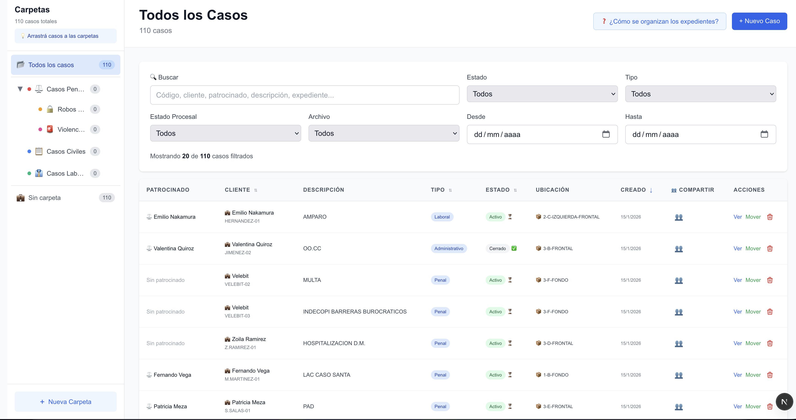
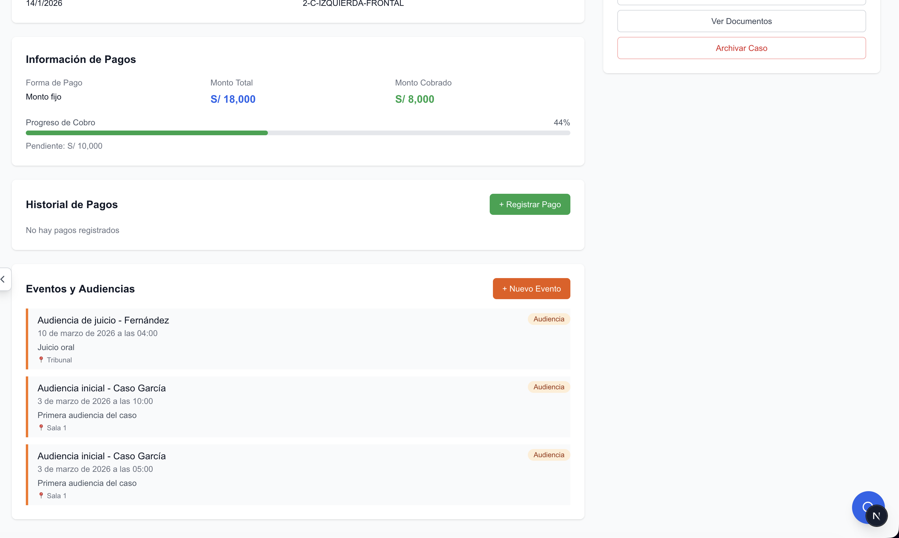
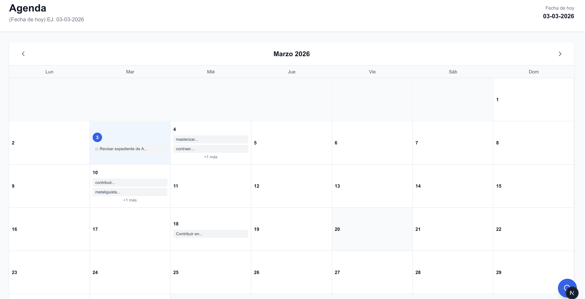

# LexDesk - Legal Case Management System

A full-featured web application for law firms to manage cases, clients, documents, and schedules.

Built for a real law firm in Lima, Peru. Currently managing 116+ active cases.


---

## Screenshots

| Dashboard | Case List |
|-----------|-----------|
|  |  |

| Case Detail | Calendar |
|-------------|----------|
|  |  |

---

## Features

- **Multi-role authentication** - Admin, Secretary, and Lawyer roles with granular permissions
- **Case management** - Full CRUD with status tracking, case types, and procedural states
- **Rich notes editor** - Per-case notes powered by Tiptap with rich text formatting
- **Smart agenda** - Calendar view with event management
- **Folder system** - Organize cases into custom folders with drag & drop
- **Dashboard & metrics** - Real-time overview of active cases and upcoming events
- **Server-side pagination** - Parallel query execution for fast data fetching
- **E2E test suite** - Playwright tests covering critical user flows

---

## Tech Stack

| Layer | Technology |
|-------|------------|
| Framework | Next.js 15 + React 19 |
| Language | TypeScript (strict mode) |
| Database & Auth | Supabase |
| Styling | Tailwind CSS 3.4 |
| UI Components | Radix UI + Lucide Icons |
| Forms | React Hook Form + Zod |
| Rich Text | Tiptap |
| Charts | Recharts |
| Testing | Playwright (E2E) |

---

## Getting Started

### Prerequisites

- Node.js 18+
- A Supabase project

### Installation

```bash
# Clone the repo
git clone https://github.com/notclapxz/legal-case-management.git
cd legal-case-management

# Install dependencies
npm install

# Set up environment variables
cp .env.example .env.local
# Fill in your Supabase URL and anon key

# Run development server
npm run dev
```

Open [http://localhost:3000](http://localhost:3000) and you're good to go.

### Running Tests

```bash
npm run test:e2e
```

---

## Project Structure

```
despacho-web/
├── app/              # Next.js App Router pages
├── components/       # Reusable UI components
├── hooks/            # Custom React hooks
├── lib/              # Supabase client, utilities
├── types/            # TypeScript type definitions
└── e2e/              # Playwright E2E tests
```

---

## Environment Variables

Copy `.env.example` to `.env.local` and fill in your values:

```env
NEXT_PUBLIC_SUPABASE_URL=
NEXT_PUBLIC_SUPABASE_ANON_KEY=
```

---

## Author

Full Stack Developer & Data Science student at UTEC (Universidad de Ingenieria y Tecnologia), Lima, Peru.

- Meta Full Stack Developer Certified
- Google Data Analytics Professional Certified

---

## License

This project is for portfolio purposes. The codebase is open for review - please reach out before using it commercially.
