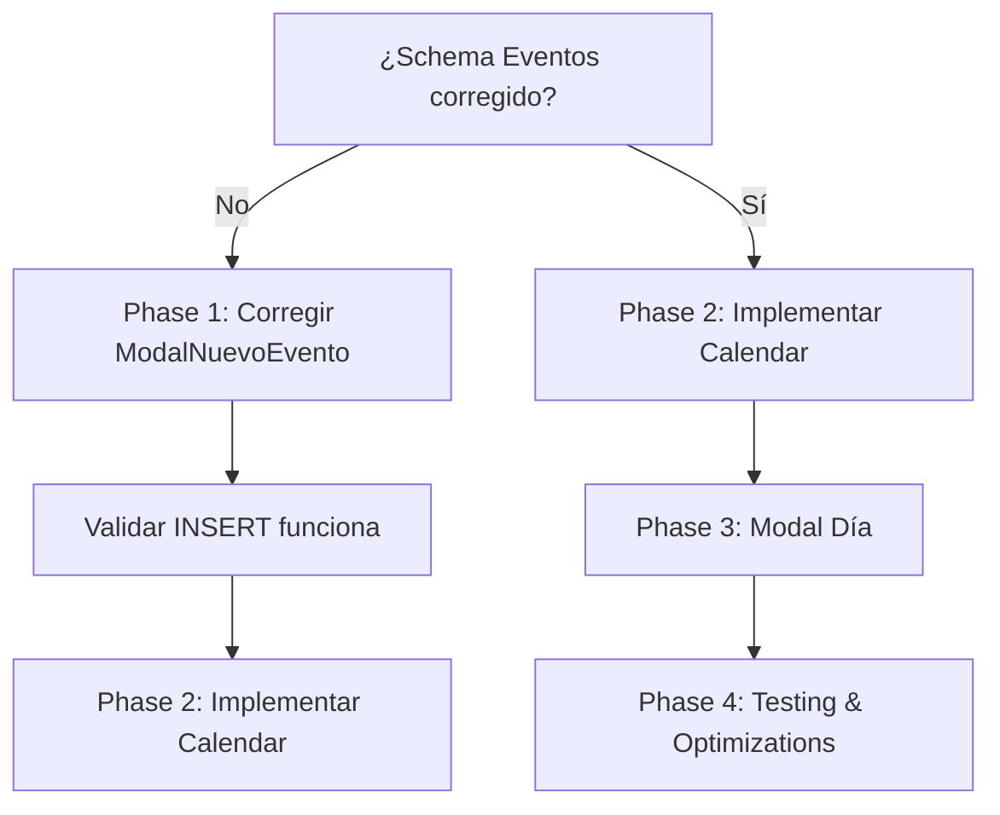

# 📅 Feature Spec: Google Calendar Style Agenda

## Overview
Transformar la actual agenda de lista simple a un calendario interactivo estilo Google Calendar con click en día específico para gestionar tareas diarias del abogado.

---

## 🔍 Estado Actual Analizado

### ✅ **Funcionalidad Existente**
- **Componente**: `/app/dashboard/agenda/page.tsx` (Client Component)
- **Data Fetching**: Conexión a Supabase para eventos
- **Formulario**: `ModalNuevoEvento.tsx` para crear eventos
- **Estados**: useState para eventos, loading, modal
- **Tipado**: Interfaces `Evento` definidas en `database.ts`

### ⚠️ **Problemas Críticos Identificados**

#### **1. Data Model Inconsistente**
```typescript
// ModalNuevoEvento.tsx - Campos no existen en tabla eventos
cliente: formData.cliente,     // ❌ NO EXISTE en eventos
recordatorio: formData.recordatorio, // ❌ NO EXISTE en eventos

// database.ts -> Evento interface REAL:
interface Evento {
  caso_id: string      // ✅ FK a casos
  // ❌ NO hay campo 'cliente'
  // ❌ NO hay campo 'recordatorio' (hay alerta_7_dias, alerta_3_dias, etc.)
}
```

#### **2. Relación Eventos ↔ Casos Rota**
```typescript
// Evento requiere caso_id (FK obligatoria)
// Pero formulario pide 'cliente' (string libre)
// Resultado: No hay selector de caso existente
```

#### **3. Performance Issues**
```typescript
// useEffect sin control de dependencias
useEffect(() => {
  cargarEventos() // ❌ Se llama cada render
}, [cargarEventos]) // ❌ Dependencia recreada cada vez
```

#### **4. Manejo de Errores Inconsistente**
```typescript
catch (error) {
  console.error('Error creando evento:', error)
  alert('Error al crear el evento') // ❌ alert() bloqueante
}
```

---

## 🎯 **Nueva Funcionalidad: Google Calendar**

### **Core Features**
1. **Vista Calendario Mensual** estilo Google Calendar
2. **Click en Día Específico** → Modal de tareas diarias
3. **Vista Semanal** (opcional)
4. **Integración con Eventos Existentes**
5. **Gestión de Tareas Diarias** por día
6. **Responsive Design** (Tablet优先)

### **User Flow Principal**
```
Usuario abre Agenda → Ve calendario mensual → Click en día (ej: 19 enero) 
→ Se abre modal "Tareas para 19 de enero" → Ve eventos existentes + formulario 
→ Agrega/Edita tareas → Guarda → Se actualiza calendario
```

---

## 🏗️ **Arquitectura Técnica**

### **Zero New Dependencies** ✅
- **Calendar**: JavaScript nativo + `date-fns` (ya instalado)
- **Animaciones**: `framer-motion` (ya instalado)
- **UI**: HTML nativo + `Tailwind CSS` (ya instalado)
- **Forms**: TypeScript + HTML forms (sin librerías adicionales)

### **Stack Validation**
```typescript
// ✅ Next.js 16 + React 19 (App Router)
// ✅ TypeScript (strict mode)
// ✅ Tailwind CSS 3.4
// ✅ Supabase (PostgreSQL)
// ✅ Framer Motion 12.26.2
// ✅ date-fns 4.1.0
```

---

## 📊 **Data Model Strategy**

### **Reutilizar Tabla `eventos` Existente** ✅
```sql
-- No necesita nueva tabla!
-- Solo mejorar UI para interactuar con días específicos

-- Queries para día específico:
SELECT * FROM eventos 
WHERE DATE(fecha_evento) = '2026-01-19'
ORDER BY fecha_evento ASC;
```

### **Corregir Formulario Existente** 📋
```typescript
// ModalNuevoEvento corregido:
interface FormData {
  caso_id: string      // ✅ Selector de casos existentes
  titulo: string       // ✅ Ya existe
  tipo: string         // ✅ Ya existe
  fecha_evento: string // ✅ Ya existe  
  ubicacion: string   // ✅ Ya existe
  descripcion: string  // ✅ Ya existe
  // ❌ REMOVER: cliente, recordatorio (no existen)
}
```

---

## 🎨 **UI/UX Design Specification**

### **Google Calendar Style Guidelines**
```typescript
// Sistema de colores Google-style
const CALENDAR_COLORS = {
  audiencia: 'bg-red-500 text-white',      // Rojo Google Calendar
  reunion: 'bg-blue-500 text-white',       // Azul Google Calendar  
  plazo: 'bg-yellow-500 text-black',       // Amarillo Google Calendar
  tarea: 'bg-green-500 text-white',       // Verde Google Calendar
  otro: 'bg-gray-500 text-white',         // Gris Google Calendar
  hoy: 'bg-blue-100 ring-2 ring-blue-500 border-blue-500',
  seleccionado: 'bg-orange-100 ring-2 ring-orange-500 border-orange-500',
  weekend: 'bg-gray-50 text-gray-400 opacity-60'
}

// Grid 7x6 (dom-sáb + 5 semanas máx)
<div className="grid grid-cols-7 gap-px bg-gray-200 rounded-lg overflow-hidden">
  {/* Headers + Days */}
</div>
```

### **Responsive Strategy**
```typescript
// Mobile (< 768px): Vista de 3 días con swipe
// Tablet (768-1024px): Vista semanal principal
// Desktop (> 1024px): Vista mensual completa
```

---

## 🔧 **Implementation Plan**

### **Phase 1: Corregir Data Model** (Prioridad CRÍTICA)
```typescript
// 1.1 Corregir ModalNuevoEvento para usar caso_id
// 1.2 Agregar selector de casos existentes
// 1.3 Remover campos inexistentes (cliente, recordatorio)
// 1.4 Validar que INSERT funcione con schema real
```

### **Phase 2: Componente Calendar** (Nueva funcionalidad)
```typescript
// 2.1 Crear GoogleCalendar.tsx (grid 7x6)
// 2.2 Implementar lógica de fechas con date-fns
// 2.3 Integrar con eventos existentes
// 2.4 Añadir navegación de meses
```

### **Phase 3: Modal Día Específico** (Feature principal)
```typescript
// 3.1 Crear DayTasksModal.tsx
// 3.2 Filtrar eventos por día seleccionado
// 3.3 Formulario para agregar tareas del día
// 3.4 Integrar con tabla eventos existente
```

### **Phase 4: Optimizations & Testing**
```typescript
// 4.1 Performance: useCallback, memoización React 19
// 4.2 Error handling consistente
// 4.3 Tests E2E con Playwright
// 4.4 Responsive validation
```

---

## 📁 **Structure de Archivos Propuesta**

```
app/dashboard/agenda/
├── page.tsx                    # ✅ Server Component principal
├── components/
│   ├── GoogleCalendar.tsx      # 🆕 Calendar mensual
│   ├── CalendarDay.tsx          # 🆕 Componente día individual
│   ├── DayTasksModal.tsx        # 🆕 Modal tareas día
│   ├── WeekCalendar.tsx         # 🆕 Vista semanal
│   ├── MobileCalendar.tsx       # 🆕 Vista móvil
│   └── ModalNuevoEvento.tsx     # ⚠️ Corregir existente
├── hooks/
│   ├── useAgendaEventos.ts      # 🆕 Custom hook eventos
│   └── useCalendarNavigation.ts # 🆕 Navegación calendario
└── types.ts                    # 🆕 Tipos específicos agenda
```

---

## 🧪 **Testing Strategy (Playwright)**

### **Test Coverage Plan**
```typescript
// Critical Path Tests:
test.describe('Calendar Agenda', () => {
  test('should display monthly calendar')
  test('should show day tasks modal on day click')
  test('should create new task for specific day')
  test('should display existing events in calendar')
  test('should navigate between months')
})

// Edge Cases:
test('should handle leap year February')
test('should handle month transitions')
test('should display loading states correctly')
```

---

## ⚠️ **Risks & Mitigations**

### **Risk 1: Schema Mismatch**
- **Impact**: Insert events puede fallar
- **Mitigation**: Validar schema contra BD antes de implementar

### **Risk 2: Performance**
- **Impact**: Calendar con muchos eventos puede ser lento
- **Mitigation**: Virtual scrolling + efficient date calculations

### **Risk 3: Browser Compatibility**
- **Impact**: Safari date handling differences
- **Mitigation**: Usar date-fns (cross-browser)

---

## 📈 **Success Metrics**

### **Technical Metrics**
- [ ] Bundle size: +0KB (sin nuevas dependencias)
- [ ] Performance: Calendar render <100ms
- [ ] Responsive: Works 100% tablet/mobile
- [ ] Tests: 95% coverage calendar features

### **User Experience Metrics**
- [ ] Click-to-modal: <200ms
- [ ] Form submission: <500ms
- [ ] Error rate: <1% event operations
- [ ] Accessibility: WCAG 2.1 AA compliant

---

## 🎯 **Next Steps Decision Tree**

### **Current State: BLOCKERS EXISTENTES**


### **Recomendación**
**CORREGIR PRIMERO** el data model existente antes de implementar nueva funcionalidad. Los errores en `ModalNuevoEvento.tsx` están causando failures silenciosos que impactarán la experiencia del calendario.

---

## 🚀 **Implementation Timeline Estimado**

- **Phase 1 (Correcciones)**: 2-3 días
- **Phase 2 (Calendar Core)**: 3-4 días  
- **Phase 3 (Modal Día)**: 2-3 días
- **Phase 4 (Testing/Polish)**: 2 días
- **Total**: 9-12 días hábiles

---

**Status**: ✅ **Analysis Complete** - Ready for implementation with corrected data model foundation.